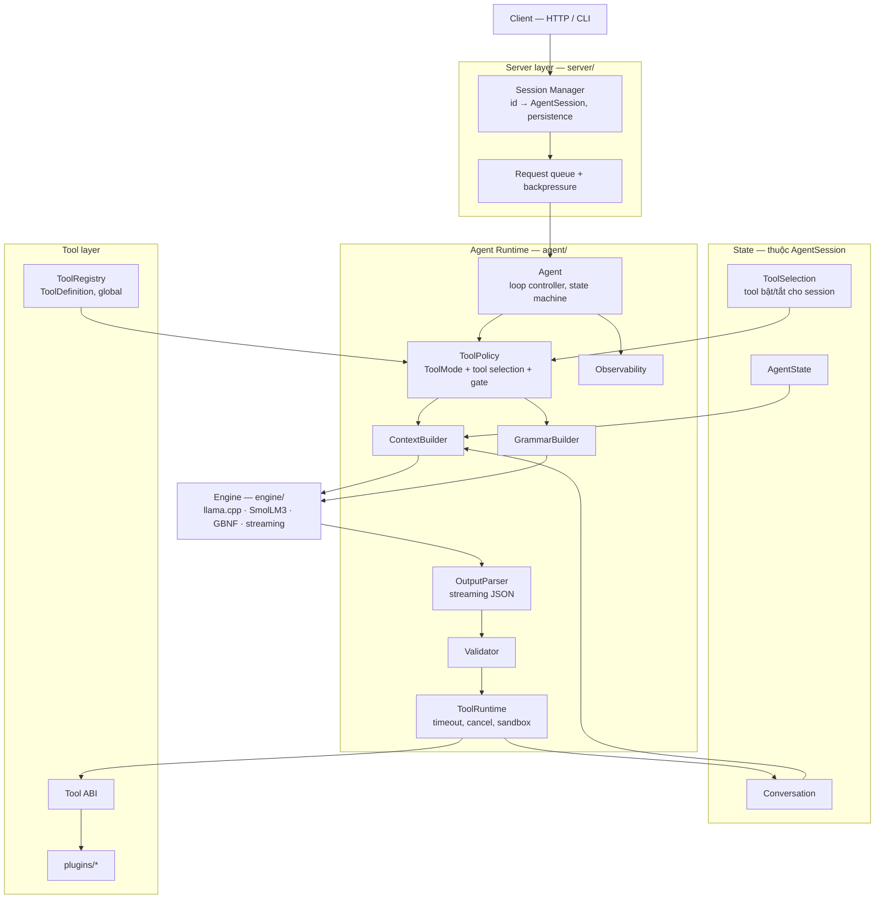
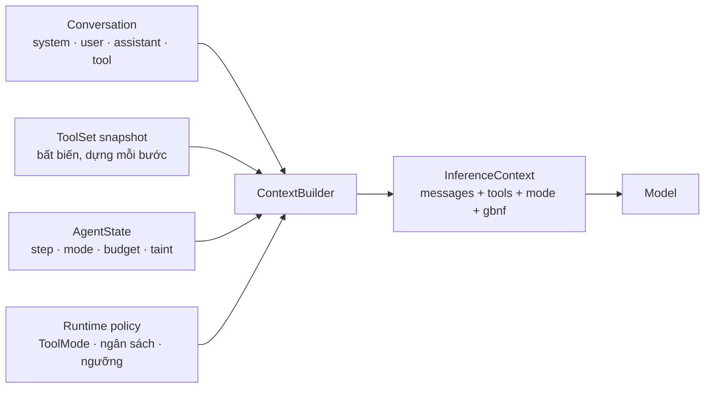
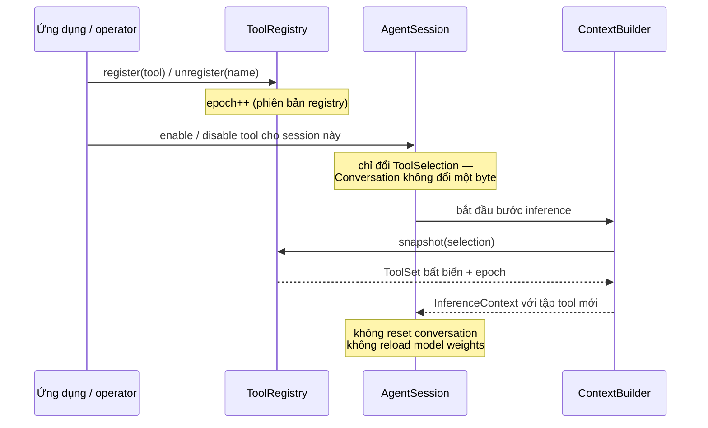
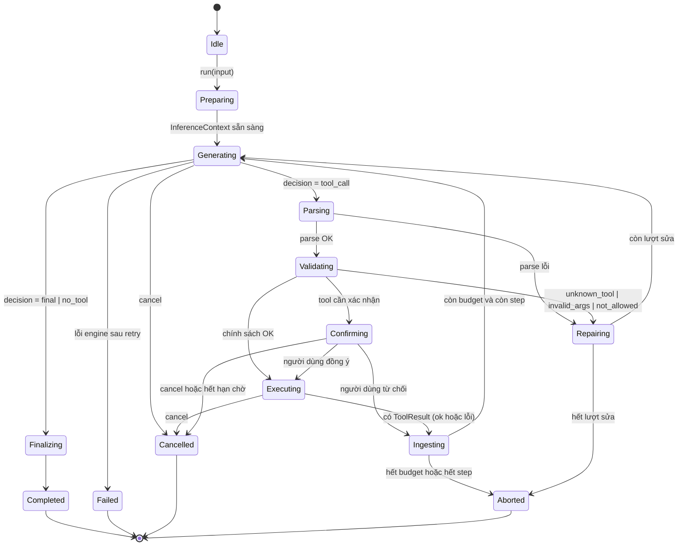
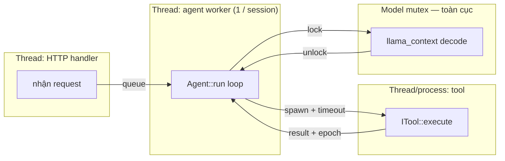

# Technical Design Document — shiro.cpp Agent Runtime

**Version** 2.0 · **Status** Draft, In Review · **Ngôn ngữ** C++ · **Model** SmolLM3 (một instance)
**Tài liệu liên quan:** [ADR](02-adr.md) · [Kế hoạch triển khai](03-implementation-plan.md) · [Quyết định còn treo](04-open-decisions.md)

---

## 1. Executive Summary

Tài liệu này định nghĩa kiến trúc Agent Runtime cho `shiro.cpp`: một lớp điều phối nằm giữa engine (wrap llama.cpp, giữ một model SmolLM3) và lớp server, chịu trách nhiệm biến một yêu cầu ngôn ngữ tự nhiên thành một chuỗi suy luận ↔ gọi tool ↔ trả lời, có kiểm soát.

Ba khẳng định định hình toàn bộ thiết kế:

**Một — Agent không phải là Model.** Model là engine sinh token. Agent Runtime sở hữu vòng lặp, trạng thái, chính sách tool, và mọi kiểm tra an toàn. Mọi quyết định có hệ quả thật đều nằm ngoài model.

**Hai — Conversation và Tool Registry là hai miền trạng thái độc lập.** Thêm, bớt, bật, tắt tool giữa các turn không đòi hỏi reset hội thoại, không đòi hỏi reload model. Tool definitions được cung cấp cho model **theo từng lần inference**, không phải theo từng session.

**Ba — sự tồn tại của tool không đồng nghĩa với việc phải gọi tool.** Đây là vấn đề thực tế đang gặp với SmolLM3 và là chủ đề của §12. Giải pháp không phải prompt, mà là một chuỗi kiểm soát trong runtime, đỉnh điểm là **cổng type-token**: tận dụng việc GBNF ép output thành JSON có trường phân loại, quyết định "gọi tool hay trả lời thẳng" thu gọn về đúng một token, và runtime có thể đọc xác suất tại token đó rồi áp ngưỡng — một router không cần model thứ hai và không tốn thêm lần inference nào.

Tài liệu đủ chi tiết để một kỹ sư khác triển khai mà không cần đọc lại ba plan gốc. Phần đối chiếu ba plan nằm ở [Phụ lục A](#phụ-lục-a--đối-chiếu-ba-plan-nguồn).

---

## 2. Goals

| ID | Mục tiêu | Đo bằng |
|---|---|---|
| G1 | Một model instance phục vụ toàn bộ agent; tool thay đổi không reload model | Test: đăng ký tool mới giữa session, không có lời gọi load model nào |
| G2 | Conversation và Tool Registry có vòng đời độc lập | Test: thay đổi registry, conversation không đổi một byte |
| G3 | Model chỉ nhìn thấy tool cần thiết cho bước hiện tại | Kiểm tra `InferenceContext.tools` theo từng bước |
| G4 | Tool calling kiểu `auto`: model có thể trả lời thẳng hoặc yêu cầu tool | Eval set có cả hai loại câu hỏi |
| G5 | Câu chào/câu hỏi kiến thức không kích hoạt tool | Tỉ lệ gọi tool thừa trên eval set "no-tool" — ngưỡng ở D9 |
| G6 | GBNF chỉ ràng buộc format, không chứa routing/business logic | Code review: `engine/` không chứa chuỗi tên tool nào |
| G7 | Người dùng dừng được giữa chừng, agent không thực thi tool sau khi dừng | Acceptance A5, A6 |
| G8 | Thêm tool mới không sửa code agent, không train lại model | Acceptance A10 |
| G9 | Kiến trúc mở rộng được sang discovery / compaction / router mà không sửa lõi | Review: mỗi tính năng tương lai ánh xạ vào một điểm mở rõ ràng (§28) |
| G10 | Độ trễ thấp trên phần cứng nhẹ | p95 — con số ở D9 |

## 3. Non-Goals

- **Không** hỗ trợ MCP — [Existing], đã quyết định chỉ dùng tool tự viết.
- **Không** multi-model router, không model thứ hai — [Existing], engine chỉ load một model. Xem ADR-011.
- **Không** gọi tool song song ở MVP — ADR-014.
- **Không** RAG / long-term memory / vector store.
- **Không** fine-tune model ở MVP — ADR-015, chỉ mở ở phase cuối có điều kiện.
- **Không** tự đánh giá tính đúng/sai của câu trả lời bằng một verifier model — ADR-018.
- **Không** thiết kế lớp server (session persistence, HTTP API) — chỉ định nghĩa ranh giới với nó.

---

## 4. Requirements

### 4.1 Functional

| ID | Yêu cầu | Nguồn |
|---|---|---|
| FR-1 | Nhận yêu cầu ngôn ngữ tự nhiên, trả lời bằng ngôn ngữ tự nhiên, có streaming | [Existing] cả 3 plan |
| FR-2 | Model có thể trả lời trực tiếp **hoặc** yêu cầu gọi tool trong cùng một cơ chế output | [Existing] PLAN 3 §9 |
| FR-3 | Hỗ trợ chuỗi nhiều bước tuần tự: tool → observation → tool tiếp → trả lời | [Existing] PLAN 1 §2, PLAN 2 §6, PLAN 3 §9 |
| FR-4 | Khi không có tool phù hợp: trả về trạng thái từ chối tường minh, không đoán | [Existing] PLAN 1 (abstention) |
| FR-5 | Tool được đăng ký/gỡ/bật/tắt/chọn theo turn mà không reset conversation, không reload model | [Existing] PLAN 3 §7 |
| FR-6 | Chính sách tool tường minh: `None` / `Auto` / `Required` / `Specific` (+ `Discovery`) | [Existing] PLAN 3 §10, mở rộng |
| FR-7 | Người dùng dừng được: dừng sinh token, dừng tool đang chạy, dừng vòng lặp | [Derived] — cả 3 plan đều thiếu |
| FR-8 | Hành động không thể hoàn tác phải có xác nhận người dùng | [Existing] PLAN 1 TASK-7, PLAN 2 §3.3 |
| FR-9 | Kết quả tool có thể kèm cờ `summary` | [Existing] |
| FR-10 | Tool discovery (`list_tools`, `get_tool_detail`) khi catalog lớn | [Existing] PLAN 3 §13 — **là mở rộng, không phải mặc định** |
| FR-11 | Giới hạn số vòng lặp, ngân sách token, timeout theo từng tool | [Derived] PLAN 2 §6 |

### 4.2 Non-functional

| ID | Yêu cầu | Trạng thái |
|---|---|---|
| NFR-1 | Độ trễ thấp, phần cứng nhẹ | Định tính → **D9** |
| NFR-2 | Agent chạy cùng process với engine, không qua network | [Existing] |
| NFR-3 | Không tràn context window dù hội thoại dài hoặc tool output lớn | §19 |
| NFR-4 | Một lỗi tool không làm sập phiên, không làm hỏng state | §17 |
| NFR-5 | Phụ thuộc ngoài tối thiểu, code tự chứa | [Existing] nguyên tắc dự án |
| NFR-6 | Chuyển trạng thái tất định, kiểm chứng được | §14 |
| NFR-7 | Thread safety xác định rõ ở ranh giới session/model/registry | §25 |
| NFR-8 | Test được mà không cần load model | `MockLLM` + golden trace |
| NFR-9 | Tương thích ngược khi schema tool hoặc protocol đổi version | §24.4 |

---

## 5. Current Problems

### 5.1 P1 — Tool overuse với model nhỏ *(vấn đề số một)*

Đưa toàn bộ tool definitions vào mọi request khiến SmolLM3 gọi tool cho cả `hello`, `how are you?`, `explain C++`. Nguyên nhân bản chất: với model nhỏ, sự hiện diện của tool definitions trong context dịch chuyển phân bố output về phía tool call — model học được rằng "có tool ⇒ dùng tool".

Điều khiến vấn đề này khó hơn vẻ ngoài: **thêm discovery không chữa được nó**. `list_tools` bản thân cũng là một tool, nên model sẽ gọi `list_tools()` cho `hello`. Discovery giải bài toán *kích thước prompt*, không giải bài toán *tool overuse*. Đây là quan sát đúng và quan trọng nhất của PLAN 3.

→ Xử lý ở §12.

### 5.2 P2 — Tool definitions bị coi như một phần cố định của conversation

Nếu nhét danh sách tool vào system message và giữ nguyên trong history, thì mỗi lần đổi tool phải sửa history hoặc reset conversation. Ngoài ra history sẽ chứa nhiều phiên bản catalog mâu thuẫn nhau.

→ Xử lý ở §10 và ADR-003.

### 5.3 P3 — Mất message tool-call của chính assistant *(bug trong PLAN 2)*

Pseudo-code gốc chỉ đẩy *kết quả tool* vào history, không đẩy *output của model chứa lời gọi tool*. Bước sau model thấy một tool result xuất hiện từ hư không, đứt mạch ReAct.

→ Xử lý ở §13.4.

### 5.4 P4 — Phát hiện tool call bằng tìm chuỗi con

`find("<tool_call>")` trên text thô: false positive khi model in ra chuỗi đó trong ví dụ, false negative khi bị cắt token.

→ Xử lý ở §16.

### 5.5 P5 — Nhầm "input sanitization" với "chống prompt injection"

Hai lớp phòng thủ khác nhau: sanitize bảo vệ *tool* khỏi tham số độc; chống injection bảo vệ *model* khỏi nội dung độc trong kết quả tool trả về. Sanitize tham số không chữa được injection.

→ Xử lý ở §21.3.

### 5.6 P6 — Độ tin cậy tương đối giữa các tool không được khai báo

PLAN 1 nêu ví dụ: cho rằng đồng hồ hệ thống "có thể lệch" nên ưu tiên tìm web. Thực tế đồng hồ hệ thống đồng bộ NTP, đáng tin và tức thời hơn nhiều. Nếu để model tự suy luận từ xác suất ngầm, nó sẽ chọn sai.

→ Xử lý bằng trường bắt buộc `when_not_to_use` trong schema, §11.2.

### 5.7 P7 — Lỗi cộng dồn qua nhiều bước

Per-step accuracy 80% ⇒ chuỗi 4 bước chỉ còn ~41%. Mục tiêu per-step phải cao hơn nhiều mức "80% rồi cải thiện dần".

→ Xử lý bằng giới hạn số bước, đo end-to-end tách khỏi per-step, và giảm số bước (một lý do nữa để không dùng discovery mặc định).

### 5.8 P8 — Context phình vô hạn

`std::vector<ChatMessage>` không giới hạn; tool đọc file/crawl web trả kết quả lớn.

→ Xử lý ở §19.

---

## 6. Design Principles

1. **Agent ≠ Model.** Model đề xuất, runtime quyết định. Mọi kiểm tra an toàn nằm ngoài model.
2. **Trạng thái được tách theo miền, không theo tiện lợi.** Conversation, ToolRegistry, AgentState là ba miền độc lập, có vòng đời riêng.
3. **Context được *dựng*, không được *tích luỹ*.** Mỗi lần inference, `ContextBuilder` quyết định lại từ đầu cái gì vào prompt. Không có cấu trúc nào "tự nhiên lớn lên".
4. **Grammar ràng buộc form, runtime quyết định nội dung.** GBNF không bao giờ chứa tên tool cụ thể như một quyết định nghiệp vụ; nó chỉ phản chiếu tập tool mà runtime đã chọn.
5. **Thứ tự bất biến giữa prompt và grammar.** Mô tả tool trong prompt và grammar ràng buộc output phải sinh từ **cùng một ảnh chụp bất biến** của tập tool, trong cùng một bước. Lệch nhau ⇒ model bị ép sinh lời gọi tới hàm nó chưa hề thấy mô tả.
6. **Đơn giản nhất thoả yêu cầu.** Không thêm model thứ hai, không thêm tầng, không thêm framework khi chưa có số đo chứng minh cần.
7. **Đo trước, tối ưu sau.** Mọi tối ưu (discovery, router, fine-tune, quantization) phải được kích hoạt bởi dữ liệu eval, không phải bởi trực giác.
8. **Lỗi không bao giờ làm hỏng state.** Mọi đường lỗi kết thúc ở một trạng thái hợp lệ.

---

## 7. Architecture Overview



**Ranh giới tuyệt đối:**

- `engine/` không chứa khái niệm "tool", "agent", "session". Nếu grep thấy tên tool trong `engine/`, thiết kế đã bị vi phạm.
- `agent/` không mở socket, không biết HTTP, không biết session id.
- `server/` không gọi engine trực tiếp, luôn đi qua agent.
- `plugins/` không gọi model, không đọc `Conversation`, không sửa `AgentState`.

---

## 8. Component Responsibilities

Bảng tóm tắt. Chi tiết từng component ở các mục sau.

| Component | Input | Output | Ai gọi | KHÔNG được làm |
|---|---|---|---|---|
| **Agent** | user input, `AgentSession&`, `CancellationToken&`, callbacks | `AgentOutcome` + sự kiện stream | Server | Không thực thi tool trực tiếp; không parse JSON ngoài `OutputParser`; không bỏ qua `Validator` |
| **Conversation** | message | chuỗi message | Agent, ContextBuilder | Không chứa tool definitions; không tự cắt |
| **ToolRegistry** | `ToolDefinition` | tra cứu, snapshot bất biến | ToolPolicy, Validator, GrammarBuilder | Không thực thi tool; không lọc theo quyền |
| **ToolSelection** | bật/tắt theo session | tập tên tool | ToolPolicy | Không giữ schema (chỉ giữ tên) |
| **ToolPolicy** | AgentState, user input, selection, registry | `ToolMode` + `ToolSet` cho bước này + tham số cổng | Agent | Không dựng prompt; không gọi model |
| **ContextBuilder** | Conversation, ToolSet, AgentState, policy | `InferenceContext` | Agent | Không gọi model; không quyết định tool; không sửa nội dung kết quả tool (chỉ cắt và bọc nhãn) |
| **GrammarBuilder** | `ToolSet` (cùng snapshot với ContextBuilder) | chuỗi GBNF | Agent | Không chứa business logic; là hàm thuần |
| **LLM Interface** | `InferenceContext` | `EngineResult` + token stream | Agent | Không biết gì về tool/policy/state |
| **OutputParser** | token stream / text đã sinh | `ModelDecision` | Agent | Không `find()` chuỗi thô; không tự điền tham số thiếu |
| **Validator** | `ToolCall`, `ToolSet`, quyền | ok hoặc `ToolStatus` lỗi | Agent | Không sửa tham số sai; không hỏi người dùng |
| **ToolRuntime** | `ToolCall`, `ToolDefinition`, cancel token | `ToolResult` | Agent | Không đưa kết quả thẳng vào Conversation; không nuốt lỗi thành chuỗi rỗng |
| **Tool (plugin)** | args đã validate | `ToolResult` | ToolRuntime qua Tool ABI | Không gọi model; không đọc Conversation; không quyết định chính sách |
| **Observability** | sự kiện | log/metrics/audit | Mọi component | Không log secret; không log toàn văn nội dung untrusted |

### 8.1 Phân định trách nhiệm ba bên

| | LLM | Agent Runtime | Tool |
|---|---|---|---|
| Hiểu ý định | ✅ | ❌ | ❌ |
| Quyết định **có cần tool hay không** | đề xuất | **quyết định cuối** (§12) | ❌ |
| Biết tool nào tồn tại | chỉ thấy tập được expose | ✅ | ❌ |
| Sinh tham số | ✅ | ❌ | ❌ |
| Quyết định được phép gọi | ❌ | ✅ | validate lại lần hai |
| Thực thi hành động thật | ❌ | ❌ (điều phối) | ✅ |
| Quyết định đã đủ để trả lời | ✅ | ❌ | ❌ |
| Dừng vòng lặp | ❌ | ✅ | ❌ |
| Giữ secret | ❌ tuyệt đối | ✅ inject | ✅ dùng |

---

## 9. Core Interfaces

Chỉ phác thảo ranh giới và quyền sở hữu, không phải hiện thực.

```cpp
// ---------- Trạng thái ----------

enum class AgentStep {
    Idle, Preparing, Generating, Parsing, Validating,
    Confirming, Executing, Ingesting, Repairing, Finalizing,
    Completed, Cancelled, Aborted, Failed
};

enum class ToolMode { None, Auto, Required, Specific, Discovery };

struct AgentState {
    AgentStep   step            = AgentStep::Idle;
    ToolMode    tool_mode       = ToolMode::Auto;
    std::string active_tool;                  // dùng cho ToolMode::Specific
    bool        waiting_for_tool_result = false;
    int         step_index      = 0;
    int         repair_count    = 0;
    int         tokens_used     = 0;
    bool        tainted         = false;      // đã nạp nội dung không tin cậy
    uint64_t    epoch           = 0;          // chống callback lạc
};

class Conversation {                          // chỉ chứa hội thoại, không chứa tool defs
public:
    void push(Message);
    const std::vector<Message>& messages() const;
    size_t approx_tokens() const;
    // cắt/nén do ContextBuilder yêu cầu, không tự làm
};

struct AgentSession {                         // đơn vị sở hữu — ADR-004
    Conversation  conversation;
    ToolSelection tool_selection;             // tool nào bật cho session này
    AgentState    state;
    AgentConfig   config;
};

// ---------- Tool ----------

struct ToolDefinition {                       // bản ghi đầy đủ trong registry
    std::string plugin, name, summary, description;
    std::string when_to_use, when_not_to_use; // bắt buộc — xem §5.6
    std::string params_schema;                // JSON Schema tập con
    std::string returns_desc;
    std::vector<std::string> error_codes;
    int      timeout_ms        = 5000;        // theo từng tool, không dùng chung
    int      max_output_tokens = 2000;
    Sensitivity sensitivity    = Sensitivity::Safe;
    SideEffect  side_effect    = SideEffect::None;
    bool     requires_confirmation = false;
    bool     idempotent        = true;
    bool     returns_untrusted = false;
    std::vector<std::string> capabilities;    // "fs:read", "net:out", "os:exec"
    int      schema_version    = 1;
};

class ToolSet {                               // ẢNH CHỤP BẤT BIẾN cho một bước — §6 nguyên tắc 5
public:
    const std::vector<const ToolDefinition*>& tools() const;
    uint64_t registry_epoch() const;
    bool contains(std::string_view plugin, std::string_view name) const;
};

class ToolRegistry {                          // global, read-mostly
public:
    void     register_tool(ToolDefinition, std::unique_ptr<ITool>);
    void     unregister(std::string_view plugin, std::string_view name);
    ToolSet  snapshot(const ToolSelection&) const;   // thread-safe
    uint64_t epoch() const;
};

struct ToolCall   { std::string id, plugin, name, args_json, thought; int step; };
struct ToolResult {
    ToolStatus  status = ToolStatus::Ok;
    std::string code, content, result_id;
    bool truncated = false, summary = false, untrusted = true;
    int64_t duration_ms = 0;
};

class ITool {                                 // Tool ABI — hợp đồng thực thi
public:
    virtual ~ITool() = default;
    virtual ToolResult execute(const ToolCall&, CancellationToken&) = 0;
};

// ---------- Context ----------

struct InferenceContext {
    std::vector<Message> messages;            // đã dựng, đã cắt, đã bọc nhãn
    ToolSet              tools;               // cùng snapshot với grammar
    ToolMode             tool_mode;
    std::string          gbnf;
    int                  max_tokens;
    ToolGateConfig       gate;                // §12.3
};

class ContextBuilder {
public:
    InferenceContext build(const Conversation&, const ToolSet&,
                           const AgentState&, const AgentConfig&) const;
};

// ---------- Engine ----------

class ILLMInterface {                         // tồn tại để có MockLLM — NFR-8
public:
    virtual ~ILLMInterface() = default;
    virtual EngineResult generate(const InferenceContext&,
                                  const TokenCallback&,
                                  CancellationToken&) = 0;
};

class CancellationToken {
public:
    bool     cancelled() const noexcept;
    uint64_t epoch()     const noexcept;
    void     cancel()    noexcept;
    CancellationToken child();                // huỷ cha huỷ toàn bộ con
};

// ---------- Agent ----------

class Agent {
public:
    AgentOutcome run(AgentSession&, std::string user_input,
                     const AgentCallbacks&, CancellationToken&);
};
```

**Cái gì là interface ảo, cái gì không.** Chỉ `ITool`, `ILLMInterface`, `IConfirmationProvider` là interface ảo — vì mỗi cái có ≥2 hiện thực thật hoặc cần mock trong test. `ToolRegistry`, `ContextBuilder`, `Validator`, `ToolRuntime`, `ToolPolicy` là class cụ thể. Đây là quyết định có chủ ý để tránh lỗi phổ biến của tài liệu thiết kế: vẽ ra một rừng interface mà chỉ có một hiện thực.

---

## 10. Context Architecture

### 10.1 Ba miền trạng thái



`Conversation` trả lời *"chúng ta đang nói chuyện gì"*. `ToolSet` trả lời *"bước này model được làm gì"*. `AgentState` trả lời *"chúng ta đang ở đâu trong vòng lặp"*. Ba câu hỏi khác nhau ⇒ ba cấu trúc khác nhau, không trộn.

### 10.2 Cái gì bền vững, cái gì tạm thời

| Nội dung | Vòng đời | Ai giữ |
|---|---|---|
| System instructions | Dựng lại mỗi inference từ template + version | ContextBuilder |
| Tin nhắn người dùng | Bền vững | Conversation |
| Assistant final | Bền vững | Conversation |
| Assistant **tool_call** | Bền vững trong turn; có thể nén ở turn sau | Conversation |
| Tool result | Bền vững trong turn; nén/bỏ ở turn sau | Conversation |
| **Tool definitions / schema** | **Tạm thời — dựng lại mỗi inference, KHÔNG BAO GIỜ ghi vào Conversation** | ToolSet |
| Output `list_tools` / `get_tool_detail` | Tạm thời trong turn | AgentState |
| Nội dung tool chưa cắt | Ngoài băng, tham chiếu qua `result_id` | ToolRuntime |
| GBNF | Dựng lại mỗi bước | GrammarBuilder |

Lý do quan trọng nhất của dòng in đậm: nếu schema lọt vào history bền vững, catalog bị đóng băng ở đó, và khi plugin đổi, model sẽ thấy hai phiên bản mâu thuẫn trong cùng một context.

### 10.3 Bố cục prompt và KV cache — *[Proposal, ADR-012]*

Đây là chi tiết mà cả ba plan đều bỏ sót nhưng ảnh hưởng trực tiếp tới NFR-1.

Tool definitions thay đổi theo từng bước. Chat template thông thường đặt chúng trong system message, tức là **trước** conversation history. Hệ quả trên llama.cpp: mỗi lần tool block đổi, toàn bộ KV cache của phần sau nó — tức toàn bộ history — bị vô hiệu hoá và phải prefill lại. Với SmolLM3 trên CPU và prompt vài nghìn token, cái giá này là hàng trăm ms **mỗi bước**, nhân với số bước trong vòng lặp.

Bố cục đề xuất, xếp theo độ ổn định giảm dần:

```
[A] System instructions            ← gần như bất biến, cache dùng lại mãi
[B] Conversation history           ← chỉ thêm vào cuối, prefix cache dùng lại được
[C] Tool block (volatile)          ← dựng lại mỗi bước, chỉ phần này bị re-prefill
[D] Điểm sinh
```

Với bố cục này, prefix cache của `A+B` sống sót qua mọi thay đổi tool, chỉ `C+D` phải prefill lại. Cache chỉ bị vô hiệu hoá khi **nén history** (§19), việc hiếm khi xảy ra.

Vì `shiro.cpp` fix cứng chat template theo model nên nó **có** quyền đặt tool block ở vị trí muộn (ví dụ như một message vai `system` chèn ngay trước lượt user cuối). Điều chưa biết là SmolLM3 có tuân thủ tốt tool definitions ở vị trí muộn hay không → **[Decision Required] D3**, giải bằng A/B eval, không bằng tranh luận.

### 10.4 Nhãn dữ liệu không tin cậy

Mọi nội dung tool trả về được bọc trong khối đánh dấu rõ là *dữ liệu*, kèm chỉ dẫn cố định trong system instructions: nội dung bên trong khối này không bao giờ là chỉ thị. Chi tiết cơ chế ở §21.3.

---

## 11. Tool Architecture

### 11.1 Bốn khái niệm không được trộn

| Khái niệm | Là gì | Ai dùng | Thay đổi kéo theo |
|---|---|---|---|
| **LLM-facing definition** | Tập con của `ToolDefinition` được serialize vào prompt + GBNF: name, description, when-to-use/when-not, params, returns, error codes | Model | Đổi ⇒ đổi prompt + grammar, không ảnh hưởng code |
| **ToolDefinition (tool schema)** | Bản ghi đầy đủ trong registry, siêu tập của trên | Validator, ToolRuntime, GrammarBuilder, ToolPolicy | Đổi ⇒ bump `schema_version` |
| **Tool ABI** | Hợp đồng thực thi: `ITool::execute(ToolCall&, CancellationToken&) → ToolResult`. Độc lập hoàn toàn với model | ToolRuntime ↔ plugin | Đổi ⇒ phải biên dịch lại toàn bộ plugin |
| **Runtime interface / plugin loading** | Cách plugin được nạp: biên dịch thẳng, `.so` động, hay tiến trình con | Plugin host | **[Decision Required] D2** |

Nếu plugin được biên dịch thẳng vào binary thì **không có vấn đề ABI** và toàn bộ hàng "Tool ABI" thu về một interface C++ bình thường. Nếu nạp `.so` động thì phải định nghĩa chữ ký export, layout struct ổn định và quy ước version. Đây là lý do D2 phải chốt sớm — nó quyết định luôn cách sandbox và cách huỷ tool (§18.2).

### 11.2 Trường của một tool

| Trường | Model thấy? | Vì sao có |
|---|---|---|
| `plugin`, `name` | ✅ | Định danh, snake_case, ổn định |
| `summary` | ✅ ở `list_tools` | Một dòng |
| `description` | ✅ | Chi tiết |
| `when_to_use` / `when_not_to_use` | ✅ **bắt buộc** | Chống chọn nhầm — trực tiếp giải P6 (§5.6) |
| `params_schema`, `returns_desc`, `error_codes` | ✅ | Sinh tham số đúng, tự phục hồi lỗi |
| `timeout_ms` | ❌ | Theo từng tool — sửa lỗi timeout dùng chung của PLAN 2 |
| `max_output_tokens` | ❌ | Chống tràn context tại nguồn |
| `sensitivity`, `side_effect`, `requires_confirmation` | ❌ | Chính sách an toàn (§21.2) |
| `idempotent` | ❌ | Quyết định có được retry tự động không |
| `capabilities[]` | ❌ | Phân quyền |
| `returns_untrusted` | ❌ | Bật taint (§21.3) |
| `schema_version` | ❌ | Eval hồi quy, tương thích ngược |

### 11.3 Tập con JSON Schema được hỗ trợ

`type` (string / number / integer / boolean / enum / array của scalar), `description`, `enum`, `minimum`/`maximum`, `maxLength`, `pattern` (chỉ dùng cho validate, không đưa vào GBNF).

**Không** hỗ trợ `oneOf` / `anyOf` / `$ref` / object lồng sâu ở MVP, vì ba lý do: phải dịch được sang GBNF; model nhỏ sinh cấu trúc lồng kém; validator tự viết sẽ phình to, vi phạm NFR-5. Tool nào cần cấu trúc phức tạp thì tách thành nhiều function đơn giản.

### 11.4 Vòng đời động của tool



Ba điều được bảo đảm, ứng với FR-5:

- **Không reload model.** Tool definitions nằm trong *inference request*, không nằm trong *model weights*. Đổi `request.tools` không chạm tới model.
- **Không reset conversation.** Conversation và ToolSelection là hai miền tách biệt (ADR-003).
- **Không lệch giữa prompt và grammar.** `ToolSet` là ảnh chụp bất biến, `ContextBuilder` và `GrammarBuilder` cùng nhận đúng một snapshot với cùng `registry_epoch`. Một thay đổi registry đến giữa bước sẽ chỉ có hiệu lực từ bước sau.

---

## 12. Tool Policy và kiểm soát tool overuse

Đây là mục trọng tâm của bản 2.0. Nó trả lời câu hỏi mà cả ba plan nguồn để ngỏ: **ai quyết định có gọi tool hay không, và bằng cơ chế gì.**

### 12.1 ToolMode

| Mode | Tool nào vào prompt | Grammar cho phép | Dùng khi |
|---|---|---|---|
| `None` | không tool nào | chỉ `final` | Session chat thuần; turn đã biết chắc không cần tool |
| `Auto` | tập đã chọn | `tool_call` \| `final` \| `no_tool` | Mặc định |
| `Required` | tập đã chọn | chỉ `tool_call` | Runtime biết chắc phải dùng tool (ví dụ user bấm nút "tra cứu") |
| `Specific` | đúng một tool | chỉ `tool_call` của tool đó | Luồng có kịch bản cố định |
| `Discovery` | chỉ `list_tools`, `get_tool_detail` (+ mở dần) | `tool_call` (discovery) \| `final` \| `no_tool` | Catalog vượt ngưỡng (§13) |

**Ai sở hữu ToolMode:** `ToolPolicy`, nằm trong runtime. Model không bao giờ được đề nghị đổi mode. `ToolMode` được quyết định lại ở **mỗi bước**, không phải mỗi session.

**Điểm cốt lõi:** `ToolMode::None` không phải là một gợi ý cho model — nó là **sự vắng mặt của nhánh `tool_call` trong GBNF**. Ở mode này, model *về mặt vật lý không thể* sinh ra một lời gọi tool. Đây là lớp kiểm soát mạnh nhất và rẻ nhất.

### 12.2 Năm lớp kiểm soát, rẻ trước đắt sau

| Lớp | Cơ chế | Chi phí | Hiệu lực | Trạng thái |
|---|---|---|---|---|
| **L0** | Không expose tool ⇒ grammar không có nhánh tool | 0 | Tuyệt đối | MVP |
| **L1** | Chất lượng mô tả: `when_not_to_use`, chỉ dẫn hệ thống, few-shot | 0 runtime, tốn prompt | Có giúp, **không đủ một mình** | MVP |
| **L2** | **Cổng type-token** (§12.3) | ~0 | Điều chỉnh được bằng ngưỡng | MVP — *[Proposal]* |
| **L3** | Heuristic pre-router trong runtime | ~0 | Hẹp, khó mở rộng | Tuỳ chọn, chỉ làm fast-path |
| **L4** | Pass phân loại riêng bằng **chính model đó** | +1 lần sinh (ngắn) + prefill | Tốt hơn L2 nhưng đắt hơn | Chỉ khi L2 đo ra không đủ |
| **L5** | Fine-tune nhắm đúng quyết định này | Rất cao | Cao nhất | Phase cuối, có điều kiện |

PLAN 3 nói đúng rằng L1 (chỉ thêm câu *"only call tools when necessary"*) không được coi là giải pháp kiến trúc. Nhưng PLAN 3 dừng ở ToolMode mà không nói **ai quyết định mode ở chế độ `Auto`** — chính là khoảng trống mà L2 lấp.

### 12.3 Cổng type-token *[Proposal — ADR-010]*

Vì output bị GBNF ép thành JSON bắt đầu bằng trường phân loại:

```json
{"type": "tool_call", ...}   |   {"type": "final", ...}   |   {"type": "no_tool", ...}
```

thì quyết định *gọi tool hay trả lời thẳng* **thu gọn về đúng một vị trí token** — token đầu tiên của giá trị trường `type`. Tại vị trí đó, grammar đã mask sạch mọi token không hợp lệ, nên phân bố xác suất còn lại chỉ trải trên đúng các nhánh hợp lệ.

Điều này cho phép một router chạy hoàn toàn trong runtime:

```cpp
// tại vị trí token quyết định, sau khi grammar đã mask
float p_tool = prob_of("tool_call");
if (mode == ToolMode::Auto && gate.enabled && p_tool < gate.threshold) {
    mask_out("tool_call");          // ép model đi nhánh final
    metrics.gate_blocked++;
}
```

**Vì sao cách này hợp lệ, trong khi PLAN 1 (P2) nói xác suất token không đáng tin.** PLAN 1 đúng trong ngữ cảnh của nó: xác suất token **không** là ước lượng đáng tin cho *tính đúng sự thật* của một câu trả lời — đó là vấn đề calibration kinh điển. Nhưng ở đây ta không hỏi "câu này có đúng không". Ta hỏi một câu **phân loại nhị phân rời rạc**, và xác suất tại token đó **chính là** ước lượng độ tự tin của model về quyết định đó, không qua trung gian nào. Đây là hai bài toán khác nhau; lập luận của PLAN 1 không áp dụng.

Kèm theo ba điều kiện bắt buộc, nếu không thì L2 chỉ là mê tín:

1. **Ngưỡng phải tinh chỉnh bằng dữ liệu**, trên một eval set có cả câu cần tool và câu không cần. Xuất ra đường cong precision/recall, chọn điểm làm việc. Không có bộ này thì không bật cổng.
2. **Ghi metric hai chiều:** số lần cổng chặn (`gate_blocked`) và số lần chặn **nhầm** (phát hiện ở eval). Chặn quá tay biến tool thành vô dụng — đây là sai lầm đối xứng với overuse, và nguy hiểm hơn vì âm thầm.
3. **Engine phải cho phép can thiệp tại vị trí token đó.** llama.cpp cho phép, nhưng lớp wrap của `shiro.cpp` hiện chưa expose → **[Decision Required] D1**.

Nếu D1 kết luận không expose được, phương án dự phòng là L4 (pass phân loại riêng bằng chính model đó, grammar ép `{"needs_tool":true|false}` — sinh ~5 token). Đắt hơn nhưng không cần model thứ hai.

### 12.4 Vì sao không dùng router model *(Level 3 của PLAN 3)*

Ba lý do, xếp theo sức nặng:

1. **Mâu thuẫn ràng buộc đã chốt:** engine chỉ load và dùng một model duy nhất. Thêm router model là đổi một quyết định kiến trúc nền, cần bằng chứng rất mạnh.
2. **Trùng lặp chức năng:** L2 đã cho một quyết định phân loại, miễn phí, từ chính model chính. Router model chỉ hơn khi L2 đo ra không đủ *và* L4 cũng không đủ.
3. **Chi phí thực:** thêm RAM cho model thứ hai, thêm một lần inference, thêm một bề mặt cần eval và versioning riêng.

Ghi nhận là mở rộng tương lai, không phải component. Xem ADR-011.

---

## 13. Tool Discovery

### 13.1 Discovery giải bài toán nào, không giải bài toán nào

| | Có giải? |
|---|---|
| Prompt phình to khi catalog lớn | ✅ — đây là lý do duy nhất nó tồn tại |
| Tool overuse với model nhỏ | ❌ — `list_tools` cũng là tool, model sẽ gọi nó cho `hello` |
| Độ chính xác chọn tool | ❌ — thêm 2 bước bắc cầu thì lỗi cộng dồn (P7) **nặng hơn** |
| Bảo mật (lộ bề mặt tool) | ✅ một phần — lộ dần thay vì lộ hết |

Kết luận: **discovery là cơ chế mở rộng quy mô, không phải kiến trúc mặc định.** Đây là thay đổi so với bản v1.0 và là điểm PLAN 3 đúng.

### 13.2 Chính sách kích hoạt

```
số tool được expose cho turn  ≤  static_threshold   →  ToolMode::Auto, expose tĩnh toàn bộ
                               >  static_threshold  →  ToolMode::Discovery
```

`static_threshold` khởi điểm đề xuất **8 tool hoặc 800 token catalog** — *[Proposal]*, hiệu chỉnh bằng số đo. Xem **D4**.

Với MVP (≤8 tool) discovery **không chạy**. Code vẫn có, vẫn test, nhưng đường mặc định là expose tĩnh.

### 13.3 Đặc tả (khi bật)

**`list_tools()`** — trả về, cho mỗi plugin: `name`, `summary` một dòng, số function. **Không** trả schema, **không** trả tham số, **không** trả tool mà session không có quyền dùng (lọc trước bằng ToolSelection + capability). Mục tiêu ≤15 token/plugin.

**`get_tool_detail(plugin)`** — trả về LLM-facing definition đầy đủ của mọi function trong plugin đó. **Không** trả: tên capability nội bộ, cấu hình sandbox, giá trị timeout, đường dẫn hiện thực, secret. Plugin không tồn tại ⇒ `unknown_tool`, model quay lại `list_tools`.

### 13.4 Grammar mở dần

Ở `ToolMode::Discovery`, tập function khả dụng trong GBNF **mở rộng dần theo tiến trình**: ban đầu chỉ có `list_tools`; sau khi gọi nó, thêm `get_tool_detail`; sau khi lấy detail của plugin X, thêm các function của X. Model không thể gọi `weather.get_current` trước khi đã `get_tool_detail("weather")`, vì nhánh đó chưa tồn tại trong grammar.

Điều này biến quy ước discovery từ một *thoả thuận mong manh trong prompt* thành một *ràng buộc cứng*.

### 13.5 Giảm chi phí độ trễ

Discovery cộng thêm 2 lần inference cho mỗi tác vụ. Hai biện pháp bắt buộc nếu bật:

1. **Cache theo session.** Plugin đã lấy detail trong session thì các turn sau `ContextBuilder` chèn sẵn schema đó và grammar mở sẵn nhánh tương ứng — từ turn thứ hai trở đi thường không tốn round trip discovery nào.
2. **Metric riêng** `discovery_roundtrips_per_task`, để thấy chi phí thật thay vì đoán.

---

## 14. Agent State Machine



### 14.1 Quy tắc

- **Ai điều khiển state:** duy nhất `Agent`. Không component nào khác được set state. `Validator`/`ToolRuntime` chỉ trả kết quả, `Agent` diễn giải. Hiện thực bằng một hàm `transition(from, to)` duy nhất, có `assert` bảng chuyển hợp lệ trong debug build (NFR-6).
- **Chuyển không hợp lệ:** `Executing → Generating` trực tiếp (bắt buộc qua `Ingesting`, để mọi kết quả tool đều được ghi vào Conversation); `Validating → Executing` khi `sensitivity != Safe` mà chưa qua `Confirming`; bất kỳ chuyển nào ra khỏi trạng thái cuối.
- **Bốn trạng thái kết thúc:** `Completed` (có câu trả lời), `Cancelled` (người dùng dừng), `Aborted` (chạm giới hạn), `Failed` (lỗi hệ thống không cứu được). Tách rõ vì metrics và UX khác nhau hoàn toàn.
- **`waiting_for_tool_result`** trong `AgentState` (PLAN 3) là dẫn xuất của `step ∈ {Confirming, Executing}`, giữ như trường tiện lợi nhưng không phải nguồn sự thật.

---

## 15. Model Integration

- **Một model instance, một `llama_context` cho MVP.** [Existing] Engine chỉ load một model.
- **Model không có trạng thái giữa các lần gọi.** Mọi thứ model "biết" đều nằm trong `InferenceContext` được truyền vào. Đây là lý do tool có thể đổi tự do giữa các bước.
- **Chat template fix cứng theo model** [Existing] — SmolLM3 renderer. Đây chính là thứ cho phép §10.3 đặt tool block ở vị trí muộn.
- **`max_tokens` theo loại bước**, không phải hằng số toàn cục (sửa lỗi 600-token cứng của PLAN 2): bước sinh tool call ngắn (đề xuất 256), bước trả lời cuối dài (đề xuất 1024), bước discovery rất ngắn (đề xuất 64). Cấu hình được.
- **Retry/backoff** cho lỗi engine (OOM, decode lỗi): tối đa 2 lần, sau đó `Failed`. Không đưa lỗi engine cho model — model không sửa được.

---

## 16. Output Protocol / GBNF

### 16.1 Định dạng

Model luôn sinh **một JSON object duy nhất**, thuộc một trong bốn dạng, ép cứng bằng GBNF:

```jsonc
{"type":"tool_call","thought":"...","plugin":"weather","name":"get_current","args":{"city":"Tây Ninh"}}
{"type":"final","content":"..."}
{"type":"no_tool","reason":"..."}
{"type":"discover","name":"list_tools"}          // hoặc get_tool_detail + plugin
```

Trường `thought` đặt **trước** `args` để suy luận diễn ra trước khi cam kết tham số. Trường `type` đặt **đầu tiên** — đây là điều kiện tiên quyết của cổng type-token (§12.3).

**Vì sao JSON discriminated union thay vì text tự do + thẻ `<tool_call>`:**

- Xoá sạch lớp lỗi P4 (§5.4). Grammar không cho phép output nào khác, nên không có gì để scan.
- Rẽ nhánh theo trường `type`, một tín hiệu có cấu trúc, không phải `find()`.
- `no_tool` (abstention, FR-4) trở thành công dân hạng nhất thay vì một quy ước prompt.
- Tạo ra đúng một điểm quyết định để cổng type-token bám vào.

**Đánh đổi:** câu trả lời cuối bị bọc trong JSON nên không stream thô được. Khắc phục: parser tăng tiến đọc từng token; khi đã xác định `"type":"final"` thì bắt đầu chuyển tiếp delta bên trong chuỗi `content` (có giải escape) ra callback. Chi phí: một state machine nhỏ trong token callback. Đây là công việc thật, đã tính vào Phase 1.

### 16.2 Phân tầng grammar

| Tầng | Nội dung | Ở đâu |
|---|---|---|
| Hạ tầng GBNF tổng quát | Compile grammar, mask token khi sample | **`engine/`** — không biết gì về tool |
| Grammar khung của agent | 4 nhánh `tool_call \| final \| no_tool \| discover` | **`agent/`** — hằng số |
| Grammar theo tool | Sinh từ `params_schema` của các function trong `ToolSet` | **`agent/`** — hàm thuần `ToolSet → string` |
| Parser output | Đọc JSON đã hợp lệ cú pháp → `ModelDecision` | **`agent/`** |

Nguyên tắc 4 (§6): grammar phản chiếu quyết định của runtime, nó không *đưa ra* quyết định. Một `ToolMode::None` biểu hiện thành "grammar không có nhánh tool_call" — grammar là *hệ quả*, `ToolPolicy` là *nguyên nhân*.

### 16.3 Định dạng kết quả trả lại model

```jsonc
{
  "tool_call_id": "c3",
  "status": "ok",            // ok | error
  "code": null,              // "timeout" | "invalid_args" | ...
  "content": "…",            // đã cắt theo max_output_tokens của tool
  "truncated": true,
  "result_id": "r7",         // đọc tiếp bằng read_more(result_id, page)
  "summary": false
}
```

Toàn khối này được `ContextBuilder` bọc nhãn dữ liệu không tin cậy trước khi vào prompt.

**Thông điệp lỗi phải hướng dẫn được cách sửa.** Tốt: `invalid_args: trường 'city' bắt buộc, kiểu string; nhận được null`. Xấu: `error`. Model chỉ tự phục hồi được khi lỗi nói rõ sai ở đâu.

---

## 17. Error Handling

| Lỗi | Phát sinh ở | Trả lại model? | Tiếp tục? | User thấy |
|---|---|---|---|---|
| `unknown_tool` | Validator | ✅ | ✅ ≤ `max_repair` | Không |
| `tool_not_allowed` | ToolPolicy | ✅ | ✅ | Không |
| `invalid_args` | Validator | ✅ kèm trường sai | ✅ | Không |
| `parse_error` | OutputParser | ✅ | ✅ sinh lại 1 lần | Không |
| `tool_unavailable` | Registry / plugin host | ✅ | ✅ | Không |
| `tool_timeout` | ToolRuntime | ✅ | ✅ retry chỉ khi `idempotent` | "đang chậm, thử cách khác" |
| `tool_exec_error` | Tool | ✅ (đã lọc secret) | ✅ | Không |
| `network_failure` | Tool | ✅ | ✅ | Không |
| `permission_denied` | ToolPolicy | ✅ | ✅ | Có thể |
| `user_declined` | Confirmation | ✅ | ✅ | Đã thấy |
| `gate_blocked` | ToolPolicy (§12.3) | ❌ (im lặng) | ✅ đi nhánh `final` | Không |
| `model_failure` (OOM, decode) | Engine | ❌ | retry ≤2 → `Failed` | Lỗi hệ thống |
| `context_exhausted` | ContextBuilder | ❌ | `Aborted` | "hội thoại quá dài" |
| `max_steps_exceeded` | Agent | ❌ | `Aborted` | "chưa xong sau N bước" + phần đã làm |
| `budget_exceeded` | Agent | ❌ | `Aborted` | Tương tự |
| `repeated_call` | Agent | ✅ observation nhắc | ✅ | Không |
| `cancelled` | Bất kỳ | ❌ | Dừng | "đã dừng" |

### 17.1 Ba nguyên tắc

1. **Lỗi model sửa được → đưa lại cho model. Lỗi model không sửa được → dừng.** Đưa lỗi OOM cho model là vô nghĩa và tốn budget.
2. **Trần số lần tự sửa** cho mỗi lớp lỗi (`max_repair`, đề xuất 2). Không có trần, model có thể đốt sạch ngân sách cho `parse_error`.
3. **`repeated_call`:** nếu model gọi đúng một `(plugin, name, args)` hai lần liên tiếp, chèn observation nhắc rằng lời gọi đó đã chạy và kết quả là gì, thay vì thực thi lại. Chống vòng lặp vô ích, tiết kiệm token, và với tool không idempotent còn tránh side effect lặp.

---

## 18. Cancellation

### 18.1 Ba tầng khác nhau, cần cả ba

| Tầng | Huỷ cái gì | Cơ chế | Độ trễ |
|---|---|---|---|
| **LLM generation** | Vòng decode hiện tại | Token callback trả `false` → `generate` thoát | ≤1 token |
| **Tool execution** | Function đang chạy | `CancellationToken&` truyền vào `ITool::execute`, tool chủ động kiểm tra | Tuỳ tool |
| **Agent execution** | Toàn bộ vòng lặp | Agent kiểm tra token ở mọi biên trạng thái | Tức thì |

Huỷ generation không dừng được tool đang chạy; huỷ tool không ngăn agent lặp tiếp. Dùng **một cây token**: token của run là cha, mỗi tool call tạo token con; huỷ cha lan xuống toàn bộ con.

### 18.2 Tool không hợp tác

Với tool hiện thực bằng lời gọi blocking, token không có tác dụng. **Không được `pthread_cancel` hay kill thread** — hỏng state, rò tài nguyên. Hai lối thoát:

- Tool chạy **out-of-process** → kill tiến trình con là an toàn và triệt để.
- Tool chạy in-process → sau timeout, **bỏ rơi**: agent đi tiếp với `ToolResult{timeout}`, thread kia chạy nốt rồi tự chết, kết quả bị vứt nhờ kiểm tra epoch.

Đây là lập luận mạnh nhất cho phương án lai ở **D2**: tool `safe` in-process cho nhanh, tool `dangerous`/`os:exec` out-of-process để kill được và sandbox được.

### 18.3 Chống callback lạc

Mỗi run có `epoch` tăng dần. Mọi callback — token stream, kết quả tool về muộn — mang theo epoch lúc phát sinh; Agent **vứt im lặng** mọi callback có epoch khác epoch hiện tại. Thiếu cơ chế này, một tool timeout trả về muộn có thể chèn kết quả vào turn sau — lỗi cực khó truy.

### 18.4 Người dùng bấm Stop — phân tích hành vi runtime

Câu hỏi "model có cần nhận một thông điệp kết thúc không?" — **không**.

1. Engine chạy in-process, không có phiên sinh phía server. Huỷ = vòng decode thoát sớm. Không có tài nguyên phía đối tác nào cần thông báo.
2. Model không có trạng thái giữa các lần gọi; lần sau chỉ phụ thuộc chuỗi message truyền vào. Nên "báo cho model biết đã dừng" là vô nghĩa **tại thời điểm huỷ**.
3. Nhưng nó **có nghĩa ở turn kế tiếp**: nếu giữ đoạn assistant sinh dở mà không đánh dấu, turn sau model sẽ thấy câu nói dở của chính mình và cố nối tiếp.

**Trình tự dọn dẹp:**

1. Set cancel trên token gốc → lan xuống con.
2. Tăng `epoch`.
3. Ngừng forward token, gửi sự kiện `cancelled` cho client.
4. Chốt Conversation: đoạn sinh dở rỗng/rất ngắn → **bỏ hẳn**; đã stream ra cho người dùng thấy → **giữ, kèm hậu tố đánh dấu** để hai bên cùng thấy một sự thật.
5. Nếu huỷ giữa lúc tool đang chạy: **bắt buộc** ghi một tool message `{status: cancelled}` cho lời gọi đó. **Bất biến cặp đôi:** message assistant chứa tool_call và tool result của nó luôn tồn tại hoặc biến mất *cùng nhau*; bỏ trống sẽ làm hỏng chat template ở turn sau.
6. Xử lý KV cache: rollback về độ dài prefix đã commit, hoặc đánh dấu bẩn để turn sau prefill lại → **[Decision Required] D12**.
7. Ghi audit: huỷ ở bước nào, tool nào đang chạy.
8. `step = Cancelled`. **Không** gọi thêm tool nào, kể cả tool đã validate xong và đang chờ.
9. **Giữ session.** Người dùng phải gửi được tin nhắn tiếp theo trên cùng session.

---

## 19. Context Management

Áp dụng theo thứ tự, dừng khi đủ chỗ:

1. **Cắt ở nguồn.** Mỗi tool result bị cắt theo `max_output_tokens` của chính tool đó, ngay tại `ToolRuntime`, không đợi lúc dựng prompt.
2. **Phân trang có handle.** Phần bị cắt vẫn giữ ngoài băng; model đọc tiếp bằng `read_more(result_id, page)` nếu thực sự cần. Giữ nguyên thông tin mà không nhồi hết vào context.
3. **Nén turn cũ.** Khi ước lượng token > `context_compact_ratio` (đề xuất 0.70), các *turn đã hoàn tất* cũ nhất bị thay bằng tóm tắt 1–2 câu. **Không bao giờ nén chuỗi tool-call của turn đang chạy** — đứt mạch suy luận.
4. **Bất biến cặp đôi** khi bỏ/nén (§18.4 điểm 5).
5. **Chặn cứng.** Nếu vẫn vượt: `Aborted` với `context_exhausted`. Thà dừng rõ ràng còn hơn để engine lỗi.

**MVP chỉ làm bước 1, 2, 5.** Bước 3 (tóm tắt) cần một lần inference nữa và cần eval riêng — đẩy sang post-MVP. Đây là ranh giới giữa "đủ dùng" và "over-engineering" mà PLAN 3 §17 nêu đúng nhưng không cắt.

---

## 20. *(gộp vào §11.4)* Dynamic Tool Lifecycle

Xem §11.4.

---

## 21. Security và Permissions

### 21.1 Kiểm tra bắt buộc nằm ngoài LLM

Allowlist tool theo bước · phân quyền theo session · validate schema và giá trị · thực thi capability · xác nhận người dùng cho hành động không hoàn tác · timeout và giới hạn tài nguyên · inject secret · audit log.

**Không kiểm tra nào trong số này được phép dựa vào việc model "hứa" tuân thủ.** Đây là hệ quả trực tiếp của nguyên tắc 1 (§6).

### 21.2 Phân cấp tool

| `sensitivity` | Ví dụ | Chính sách |
|---|---|---|
| `safe` | đọc giờ, tính toán | Chạy tự do, in-process |
| `sensitive` | đọc file, HTTP ra ngoài | Cần capability; log audit; bật `returns_untrusted` |
| `dangerous` | ghi/xoá file, chạy lệnh hệ thống, gửi mail | **Bắt buộc** xác nhận người dùng + out-of-process + audit đầy đủ |

Suy diễn mặc định: `side_effect == irreversible` ⇒ `requires_confirmation == true`, **không cho ghi đè thành false**.

### 21.3 Chống prompt injection — nhiều lớp

Giữ phân biệt đúng của PLAN 2 (§5.5) và cụ thể hoá thành cơ chế:

1. **Gắn nhãn cấu trúc.** Nội dung tool trả về nằm trong khối đánh dấu rõ là *dữ liệu*, kèm chỉ dẫn cố định trong system instructions: nội dung bên trong khối này không bao giờ là chỉ thị.
2. **Taint tracking cụ thể.** `AgentState.tainted` bật khi bất kỳ tool nào có `returns_untrusted` trả kết quả, kèm danh sách nguồn. Khi `tainted == true`, mọi tool `dangerous` **bắt buộc** qua xác nhận kể cả khi bình thường không cần. Cờ chỉ tắt ở ranh giới turn mới. *(Đây là phiên bản hiện thực được của `contextContainsUntrustedContent` trong pseudo-code PLAN 2 — bản gốc chỉ có tên hàm, không có định nghĩa.)*
3. **Chặn luồng dữ liệu ra.** Nếu tham số của một tool `net:out` chứa đoạn khớp đáng kể với nội dung vừa đọc từ nguồn untrusted → dấu hiệu rò rỉ, bắt buộc xác nhận. Heuristic, không hoàn hảo, nhưng chặn được dạng phổ biến nhất.
4. **Tách model đọc nội dung ngoài khỏi model gọi tool nhạy cảm** — mâu thuẫn ràng buộc một model, ghi nhận là hướng tương lai, **không làm**.
5. **Chấp nhận rủi ro tồn dư.** Không kỹ thuật nào loại bỏ hoàn toàn. Lớp cuối cùng là con người: hành động không hoàn tác luôn có người xác nhận.

### 21.4 Secret

Tool nhận credential từ **secret store của runtime**, dựa trên tên tool, **không bao giờ** từ tham số do model sinh. Model không được thấy tên biến secret. Log áp `redact_keys` trước khi ghi. Cơ chế lưu → **D11**.

### 21.5 Giới hạn tài nguyên

Mỗi tool call: timeout riêng, giới hạn kích thước output, giới hạn bộ nhớ (chỉ ép được khi out-of-process). Mỗi run: `max_steps`, `token_budget`, `wall_clock_budget`. Mỗi process: số session đồng thời (§25).

---

## 22. Observability

### 22.1 Định danh

`request_id` (client) → `session_id` → `run_id` (một lần `Agent::run`) → `step_index` → `tool_call_id`. Mọi bản ghi mang đủ chuỗi này.

### 22.2 Ba mức log

| Mức | Nội dung | Mặc định |
|---|---|---|
| **Debug** | Prompt đầy đủ, output thô, GBNF đã dùng, thời gian từng token, **phân bố xác suất tại token quyết định** | **Tắt** — chứa dữ liệu nhạy cảm, xoay vòng nhanh |
| **Operational** | Chuyển trạng thái, `ToolMode` mỗi bước, tên tool, thời gian thực thi, status, token in/out, số bước, lý do kết thúc, `gate_blocked` | Bật — là nguồn metrics |
| **Audit** | Mọi lời gọi tool `sensitive`/`dangerous`: ai, khi nào, tham số (đã che), có xác nhận không, kết quả | Bật, **append-only, bền vững qua restart** |

**Không log:** secret, tham số thô của tool `dangerous` chưa che, toàn văn nội dung untrusted (chỉ log hash + độ dài + nguồn).

### 22.3 Metrics

Độ trễ theo bước và theo run (p50/p95) · token prompt/output mỗi run · số bước mỗi run (histogram) · tỉ lệ thành công từng tool · tỉ lệ timeout · tỉ lệ `Aborted`/`Failed`/`Cancelled` · số lần tự sửa lỗi · **`tool_call_rate` tách theo lớp câu hỏi (cần tool / không cần tool)** — đây là metric trung tâm cho §12 · `gate_blocked` và tỉ lệ chặn nhầm · `discovery_roundtrips_per_task` · **tỉ lệ KV cache hit trên prefix** (xác nhận §10.3 có tác dụng).

### 22.4 Versioning

Mỗi run ghi: version system prompt, `schema_version` của từng tool đã dùng, version protocol output, id + hash model. Không có bốn thứ này thì không so sánh được hai lần đo, và mọi "cải tiến prompt" chỉ là cảm tính.

---

## 23. Performance

| Yếu tố | Ảnh hưởng | Xử lý |
|---|---|---|
| **Prefill lại mỗi bước** | Lớn nhất. Prompt vài nghìn token trên CPU = hàng trăm ms/bước | Bố cục prompt theo KV cache (§10.3) |
| **Số bước trong vòng lặp** | Tuyến tính với độ trễ tổng | Không dùng discovery mặc định (§13.1); `repeated_call` cắt sớm |
| **Kích thước tool block** | Prefill mỗi bước | Mô tả súc tích; chỉ expose tool liên quan cho turn |
| **Tool call thừa** | Một round trip hoàn toàn lãng phí | Cổng type-token (§12.3) — đây cũng là tối ưu hiệu năng, không chỉ tối ưu hành vi |
| **Kích thước model** | Cố định | Quantization ở phase tối ưu, phải đo lại accuracy sau khi quantize |
| **Nén history** | Một lần inference thêm, hiếm | Ngưỡng cao (0.70), post-MVP |

**Ngân sách độ trễ mục tiêu:** chưa có số → **D9**. Cấu trúc để đo: `t_total = Σ(t_prefill + t_decode + t_tool)` theo từng bước, log riêng từng thành phần ngay từ Phase 1.

---

## 24. *(bổ sung)* Concurrency, Resource Ownership, Compatibility

### 24.1 Quyền sở hữu

| Tài nguyên | Chủ sở hữu | Vòng đời |
|---|---|---|
| Model weights + `llama_context` | Engine, singleton | Suốt process |
| `AgentSession` (Conversation, ToolSelection, AgentState) | Session Manager (server) | Từ lúc tạo session tới lúc hết hạn |
| `ToolRegistry` + instance `ITool` | Process, global | Suốt process |
| `ToolSet` snapshot | Một bước inference | Bất biến, huỷ sau bước |
| `CancellationToken` cây | `Agent::run` | Một run |
| Nội dung tool chưa cắt (`result_id`) | ToolRuntime | Hết turn hoặc theo TTL |

### 24.2 Thread safety

- **`llama_context` không thread-safe và chỉ decode được một luồng tại một thời điểm.** Hệ quả: nhiều session đồng thời phải **serialize trên một mutex model**, hoặc mỗi session một context (tốn RAM cho KV cache, với SmolLM3 và ctx vài nghìn token là đáng kể). MVP chọn serialize + hàng đợi có giới hạn; vượt giới hạn thì từ chối hoặc xếp hàng. Số session đồng thời → **D10**.
- **`ToolRegistry` read-mostly:** `shared_mutex`, hoặc snapshot copy-on-write. `ToolSet::snapshot()` phải atomic so với `register`/`unregister`.
- **`AgentSession` single-threaded:** đúng một `Agent::run` trên một session tại một thời điểm. Ép bằng một cờ `busy` trong session; request thứ hai trên cùng session bị từ chối hoặc xếp hàng.
- **Tool execution có thể ở worker thread** (để timeout và cancel hoạt động), nhưng đúng một tool tại một thời điểm cho mỗi run.

### 24.3 Sơ đồ ranh giới luồng



### 24.4 Tương thích ngược

- **`schema_version` theo từng tool.** Đổi kiểu tham số hoặc bỏ trường bắt buộc = breaking, phải bump. Registry từ chối nạp plugin có `schema_version` ngoài dải hỗ trợ.
- **Version protocol output.** Nếu đổi hình dạng JSON (§16.1), bump và ghi vào log run — nếu không, eval trace cũ trở nên vô nghĩa mà không ai biết.
- **Định dạng session lưu trữ.** Nếu D6 chọn bền vững qua restart, cần version cho định dạng đó. Session ghi bằng version cũ phải đọc được hoặc bị từ chối tường minh, không được đọc sai im lặng.
- **Tool ABI.** Nếu D2 chọn `.so` động, mọi thay đổi `ITool` hay layout `ToolResult` là breaking cho mọi plugin đã build.

---

## 25. Failure Scenarios

| Kịch bản | Hành vi mong đợi | Phục hồi |
|---|---|---|
| Không có tool phù hợp | Model phát `no_tool`; đây là output **hợp lệ**, không phải lỗi | Agent → `Finalizing` với thông điệp từ chối, gợi ý diễn đạt lại |
| Tool đúng nhưng thực thi lỗi (mất mạng) | `ToolRuntime` bắt, không phải thứ model cần dự đoán trước | Observation lỗi về model; model thử lại / đổi cách / báo người dùng |
| Model gọi tool cho câu chào | Cổng type-token chặn, hoặc `ToolMode::None` khiến grammar không có nhánh đó | Trả lời trực tiếp; đếm vào `gate_blocked` |
| Cổng chặn nhầm một câu thực sự cần tool | Model trả lời từ trí nhớ tham số — **nguy hiểm vì âm thầm** | Bắt bằng eval set, hạ ngưỡng; đây là lý do metric hai chiều ở §12.3 là bắt buộc |
| Registry đổi giữa lúc agent đang chạy | Snapshot bất biến ⇒ bước hiện tại không bị ảnh hưởng | Thay đổi có hiệu lực từ bước sau |
| Tool treo, không hợp tác cancel | Timeout → `ToolResult{timeout}`, thread bị bỏ rơi, kết quả muộn bị vứt theo epoch | Agent đi tiếp |
| Plugin crash (out-of-process) | Tiến trình con chết, `tool_exec_error` | Agent đi tiếp; tool bị đánh dấu unhealthy sau N lần |
| Context đầy giữa chuỗi nhiều bước | Cắt/phân trang; nếu vẫn đầy → `Aborted{context_exhausted}` | Người dùng bắt đầu turn mới |
| Người dùng Stop giữa lúc tool chạy | §18.4 | Session vẫn dùng được cho turn sau |
| Hai request đồng thời trên cùng session | Từ chối hoặc xếp hàng (§24.2) | Client retry |

---

## 26. MVP Scope

### Trong MVP

Một model, một context · `ToolMode::None` và `Auto` · expose tool tĩnh, ≤8 tool · protocol JSON discriminated union + GBNF · streaming câu trả lời cuối · vòng lặp tool tuần tự, một tool mỗi bước · cancellation ba tầng · taxonomy lỗi đầy đủ + tự sửa có trần · `max_steps` + token budget + timeout theo tool · cắt output tại nguồn + `read_more` · tool in-process `safe` và `sensitive` · log operational + metrics cơ bản · `MockLLM` + golden trace.

### Ngoài MVP

Tool discovery · `ToolMode::Required`/`Specific` · tool `dangerous` + out-of-process + xác nhận người dùng · capability/permission đầy đủ · taint tracking · nén/tóm tắt history · gọi tool song song · router heuristic hoặc router model · audit log bền vững · quantization · fine-tune.

**Cổng type-token (§12.3) nằm trong MVP** dù được đánh dấu *[Proposal]* — vì nếu không có nó, MVP sẽ biểu hiện đúng vấn đề P1 ngay từ ngày đầu và không ai đánh giá được gì khác.

---

## 27. Future Extensions

Mỗi mở rộng ánh xạ vào **đúng một điểm mở** đã có trong kiến trúc, không cần thiết kế lại lõi (G9):

| Mở rộng | Điểm mở |
|---|---|
| Tool discovery | Thêm `ToolMode::Discovery` + hai tool nội bộ; `ToolPolicy` đổi mode theo ngưỡng |
| Router heuristic | Một hàm trong `ToolPolicy` chạy trước khi chọn mode |
| Router model | Một hiện thực `ILLMInterface` thứ hai — nhưng xem ADR-011 |
| Nén / tóm tắt context | Một chiến lược trong `ContextBuilder` |
| Gọi tool song song | GBNF đổi `tool_call` → mảng; `ToolRuntime` chạy song song; state machine không đổi |
| Tool nhạy cảm out-of-process | Một hiện thực `ITool` thứ hai (proxy tới tiến trình con) |
| Multi-model | Vi phạm ràng buộc hiện tại, cần ADR mới |
| Fine-tune | Ngoài runtime hoàn toàn; chỉ đổi file model |

---

## Phụ lục A — Đối chiếu ba plan nguồn

### A.1 Ba plan ở ba tầng khác nhau

```
Tầng 3 — Model specialization   PLAN 1: distillation, LoRA, eval accuracy
Tầng 2 — Agent runtime          PLAN 2: ReAct loop, registry, executor, context
                                PLAN 3: multi-context, ToolMode, ContextBuilder, dynamic tools
Tầng 1 — Engine                 Đã có: wrap llama.cpp, SmolLM3, GBNF, streaming
```

PLAN 2 và PLAN 3 cùng tầng và **bổ sung** cho nhau: PLAN 2 mạnh về vòng lặp, lỗi, an toàn, observability; PLAN 3 mạnh về tách trạng thái, dynamic tool, chính sách tool. PLAN 1 ở tầng khác và bị đặt sai thứ tự.

### A.2 Bảng xung đột và xử lý

| ID | Điểm | PLAN 1 | PLAN 2 | PLAN 3 | Quyết định |
|---|---|---|---|---|---|
| X1 | Phạm vi dự án | Train model | Runtime | Runtime | Không mâu thuẫn — ba tầng. Runtime trước, fine-tune là phase cuối có điều kiện (ADR-015) |
| X2 | Ngôn ngữ / stack | "chưa xác định" | C++ | C++ / shiro.cpp | C++ [Existing] |
| X3 | Đưa tool vào context | ADR-005 gốc: toàn bộ catalog mỗi lượt | Không nói | Chỉ expose tool cần cho turn | **Theo PLAN 3.** Tinh thần "catalog ngoài trọng số model" của PLAN 1 giữ nguyên (ADR-003, ADR-008) |
| X4 | Tool discovery | Không nói | Không nói | Có, nhưng ở Phase 4 và **không chữa được overuse** | **Theo PLAN 3** — đảo lại so với bản v1.0 (ADR-009) |
| X5 | Ai giữ conversation | Không nói | `history` vector trong agent, không giới hạn | `AgentSession { Conversation, ToolRegistry, AgentState }` | **Theo PLAN 3** (ADR-004) — đổi so với v1.0 |
| X6 | Phát hiện tool call | Không nói | Cấm `find()` chuỗi thô | GBNF đảm bảo format | Hợp nhất: JSON union + stop reason có cấu trúc (ADR-005) |
| X7 | Verification layer | Component riêng, 3 phương án | Không có; HITL + guard | Không có | **Loại** (ADR-018) |
| X8 | Phân loại lỗi | 2 loại | 5+ loại rời | Liệt kê ở §11 | Một taxonomy duy nhất (§17) |
| X9 | Timeout | Không nói | 15000 ms chung | Không nói | Theo từng tool (§11.2) |
| X10 | Giới hạn sinh | Không nói | 600 token cứng | Không nói | Theo loại bước (§15) |
| X11 | Tool overuse | Không nói | Không nói | **Nhận diện đúng**, đề xuất ToolMode | Mở rộng thành 5 lớp + cổng type-token (§12) |
| X12 | Router model | Không nói | Không nói | Level 3, tuỳ chọn | Không làm; mâu thuẫn ràng buộc một model (ADR-011) |
| X13 | GBNF ở đâu | Không nói | Dùng GBNF nhưng vẫn `find()` | Chỉ ràng buộc format | **Theo PLAN 3** (ADR-006) |
| X14 | Mục tiêu hiệu năng | >95% per-step | Không số | Không số | Giữ làm định hướng, **chưa validate** → D9 |

### A.3 Thiếu ở cả ba plan, đã bổ sung

Cancellation ba tầng · streaming khi output bị ép JSON · epoch chống callback lạc · state machine tường minh · **bố cục prompt theo KV cache** · **đồng thời / thread safety / mô hình session của server** · quyền sở hữu tài nguyên · tương thích ngược và versioning · quản lý secret · **ai quyết định ToolMode ở chế độ Auto** · ABI của plugin · bất biến snapshot giữa prompt và grammar.

### A.4 Đã bỏ vì thừa hoặc chưa có cơ sở

Verification Layer như một component (PLAN 1) · pipeline distillation + LoRA đặt ở Phase 3–4 (PLAN 1) · Backup/Recovery, Migration, Deployment rỗng (PLAN 1) · "Tool Router" như component riêng (model chính là router) · router model ở MVP (PLAN 3 Level 3) · tóm tắt/relevant-history-selection ở MVP (PLAN 3 §17 — đúng hướng nhưng chưa đến lúc).

---

## Phụ lục B — Glossary

| Thuật ngữ | Nghĩa trong tài liệu này |
|---|---|
| **Agent Runtime** | Lớp điều phối giữa engine và server; sở hữu vòng lặp và mọi quyết định |
| **Turn** | Một lượt: từ tin nhắn người dùng tới câu trả lời cuối. Có thể gồm nhiều **step** |
| **Step** | Một lần inference + (có thể) một lần thực thi tool |
| **Run** | Một lần gọi `Agent::run`, tương ứng một turn |
| **ToolSet** | Ảnh chụp bất biến của tập tool được expose cho **một step** |
| **ToolSelection** | Tập tên tool được bật cho **một session** |
| **ToolMode** | Chính sách gọi tool của một step: None/Auto/Required/Specific/Discovery |
| **Cổng type-token** | Cơ chế can thiệp xác suất tại token phân loại để kiểm soát tool overuse |
| **Tool ABI** | Hợp đồng thực thi C++ giữa runtime và plugin, độc lập với model |
| **LLM-facing definition** | Tập con của tool schema được đưa vào prompt và grammar |
| **Taint** | Trạng thái context đã nạp nội dung từ nguồn không tin cậy |
| **Epoch** | Số tăng dần mỗi run, dùng để vứt callback lạc |
| **Abstention** | Model từ chối tường minh (`no_tool`) thay vì đoán |