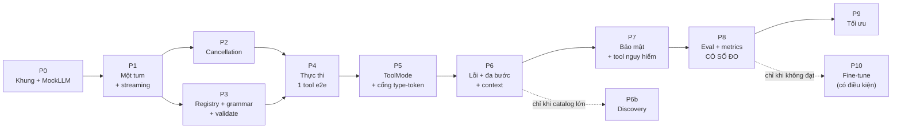

# Kế hoạch triển khai — shiro.cpp Agent Runtime

**Version** 2.0 · Đi kèm [01-design.md](01-design.md) và [02-adr.md](02-adr.md). Quyết định còn treo ở [04-open-decisions.md](04-open-decisions.md).

---

## 1. Nguyên tắc lập kế hoạch

1. **Mỗi phase chạy được và test được độc lập.** Không phase nào chỉ là "viết interface".
2. **Cancellation làm sớm.** Gắn nó vào sau là phải sửa mọi hàm đã viết.
3. **`MockLLM` trước Agent.** Không có nó thì mỗi lần test phải load model — đây là lý do phổ biến nhất khiến một agent C++ trở nên không thể kiểm thử.
4. **Đo trước, tối ưu sau.** Discovery, router, quantization, fine-tune đều phải được kích hoạt bởi dữ liệu, không bởi trực giác.
5. **Không chờ chốt hết quyết định mới bắt đầu.** Phase 0 và 1 không phụ thuộc quyết định nào.

---

## 2. Chuẩn bị

### 2.1 Đã có

Engine wrap llama.cpp, load một model SmolLM3 · `applyChatTemplate` (chat template fix cứng theo model) · `generateStream` + token callback · hỗ trợ GBNF · `ChatMessage` / `ChatRole` / `EngineResult` · `engine/` là static lib.

### 2.2 Phải thiết kế trước khi code

Định dạng khai báo `ToolDefinition` và cách plugin đăng ký function · tập con JSON Schema + luật dịch sang GBNF · văn bản thông điệp lỗi trả cho model · bảng chuyển trạng thái hợp lệ · mô hình capability · chiến lược cắt context và ngưỡng · bộ eval (≥40 case, chia bốn lớp ở §4.4).

### 2.3 Phải hiện thực

`ILLMInterface` + `MockLLM` · `Conversation` · `AgentSession` · `ToolRegistry` + `ToolSet` snapshot + plugin loader · `ToolPolicy` + cổng type-token · `ContextBuilder` · `GrammarBuilder` · parser JSON tăng tiến · `Validator` · `ToolRuntime` (timeout, cancel, out-of-process host) · `CancellationToken` cây + epoch · `IConfirmationProvider` · logger ba mức + redaction + audit store · eval harness golden-trace · ba tool khởi điểm: `time.now` (safe), `fs.read_text` (sensitive), `os.open_url` (dangerous).

### 2.4 Quyết định chặn

Xem [04-open-decisions.md](04-open-decisions.md). Tóm tắt: **D1** và **D3** chặn Phase 2; **D2** chặn Phase 3 và Phase 7; **D4** chặn Phase 6; **D5, D11** chặn Phase 7; **D6, D9, D10** chặn Phase 8.

---

## 3. Các phase



---

### Phase 0 — Khung và hợp đồng

**Mục tiêu** Cố định kiểu dữ liệu và cấu hình; có `MockLLM` để mọi phase sau test được mà không cần model.

**Tiền đề** Engine build được.

**Việc làm** Tạo `agent/` static lib · định nghĩa `AgentStep`, `ToolMode`, `AgentState`, `ToolCall`, `ToolResult`, `ToolDefinition`, `AgentConfig`, `AgentOutcome`, `AgentSession` · logger ba mức với `session_id`/`run_id`/`step_index` · bọc engine sau `ILLMInterface` · viết `MockLLM` phát lại một chuỗi output cố định.

**Interface giới thiệu** `ILLMInterface`, `MockLLM`, các struct ở §9 design doc.

**Phụ thuộc** Không.

**Kiểm chứng** Unit test: `MockLLM` phát đúng chuỗi đã script; log ra đủ chuỗi định danh.

**Kết quả** `agent/` build được, test chạy được, không cần GPU/model.

**Exit criteria** Viết được một test hoàn chỉnh mà không load model thật.

---

### Phase 1 — Một turn, không tool, có streaming

**Mục tiêu** Đi hết `Idle → Preparing → Generating → Finalizing → Completed`, có streaming.

**Tiền đề** Phase 0.

**Việc làm** `Conversation` · `ContextBuilder::build()` dựng system instructions + history · grammar khung chỉ có nhánh `final` · **parser JSON tăng tiến** stream nội dung trường `content` ra callback (đây là công việc thật, không phải chi tiết nhỏ) · `AgentOutcome` · log `t_prefill` / `t_decode` riêng ngay từ đây.

**Interface** `Agent::run()`, `Conversation`, `ContextBuilder`, `AgentCallbacks`, `OutputParser`.

**Phụ thuộc** Phase 0.

**Kiểm chứng** Test với `MockLLM` phát JSON từng mảnh, kiểm tra delta stream ra đúng và giải escape đúng (bao gồm unicode tiếng Việt) · chạy tay với SmolLM3.

**Kết quả** Một chatbot streaming, chưa có tool.

**Exit criteria** Token chảy ra đúng thứ tự, không rò bộ nhớ sau 1000 turn, log có `t_prefill`/`t_decode` tách bạch.

---

### Phase 2 — Cancellation

**Mục tiêu** Stop dừng thật, state nhất quán, session dùng tiếp được.

**Tiền đề** Phase 1. Chốt **D12** (KV cache).

**Việc làm** `CancellationToken` cây cha-con + epoch · kiểm tra token trong token callback và mọi biên trạng thái · xử lý đoạn sinh dở theo §18.4 design doc · xử lý KV cache · vứt callback lạc theo epoch.

**Interface** `CancellationToken`.

**Kiểm chứng** Huỷ ở token thứ 1, thứ N, và ngay sau khi sinh xong · kiểm tra `Conversation` sau huỷ hợp lệ · kiểm tra turn tiếp theo vẫn chạy đúng.

**Exit criteria** Huỷ 100 lần liên tiếp: không crash, không message mồ côi, không token nào lọt ra sau thời điểm huỷ.

---

### Phase 3 — Registry, schema, grammar, validate *(chưa thực thi tool)*

**Mục tiêu** Model sinh được một tool call hợp lệ cả về cú pháp lẫn schema.

**Tiền đề** Phase 1. Chốt **D2** (mô hình nạp plugin).

**Việc làm** `ToolDefinition` + plugin loader · `ToolRegistry` + `ToolSet::snapshot()` · `GrammarBuilder` sinh GBNF từ `ToolSet` · mở rộng parser sang bốn nhánh `tool_call | final | no_tool | discover` · `Validator` bốn bước theo thứ tự. Tool call qua validate thì **chỉ log rồi trả về**, chưa chạy.

**Interface** `ToolRegistry`, `ToolSet`, `buildGbnf()`, `Validator`.

**Kiểm chứng** Unit test grammar cho ~10 schema · property test: mọi output do grammar sinh đều parse được · test validator với tham số sai kiểu / thiếu / thừa / enum sai · **test bất biến snapshot**: đổi registry giữa chừng, prompt và grammar của bước đang chạy không đổi.

**Exit criteria** Với SmolLM3 và một tool khai báo, 20/20 lần sinh ra tool call parse được và qua validator.

---

### Phase 4 — Thực thi và vòng lặp hoàn chỉnh (một tool)

**Mục tiêu** End-to-end đầu tiên: hỏi giờ → gọi `time.now` → trả lời.

**Tiền đề** Phase 2 và 3.

**Việc làm** Tool ABI (`ITool`) + `time.now` · `ToolRuntime` với timeout theo tool · cắt output tại nguồn · trạng thái `Ingesting` · **ghi message assistant chứa tool_call vào `Conversation` trước khi thực thi** (sửa bug P3) · `max_steps`.

**Interface** `ITool`, `ToolRuntime`.

**Kiểm chứng** E2E kịch bản giờ · test `max_steps` bằng `MockLLM` gọi tool vô hạn · test bất biến cặp đôi (tool_call ↔ tool_result).

**Exit criteria** E2E xanh với cả `MockLLM` lẫn SmolLM3; agent không bao giờ lặp quá `max_steps`.

---

### Phase 5 — ToolMode và cổng type-token *(phase quan trọng nhất)*

**Mục tiêu** Giải vấn đề P1: `hello` không kích hoạt tool.

**Tiền đề** Phase 4. Chốt **D1** (hook sampler). Có eval set lớp "no-tool".

**Việc làm** `ToolPolicy` với `ToolMode::None` và `Auto` · `ToolMode::None` biểu hiện thành grammar không có nhánh `tool_call` · cổng type-token: đọc phân bố xác suất tại token quyết định, áp ngưỡng, mask · metric `tool_call_rate` tách theo lớp câu hỏi, `gate_blocked`, tỉ lệ chặn nhầm · log `ToolMode` mỗi step · công cụ quét ngưỡng sinh đường cong precision/recall.

**Interface** `ToolPolicy`, `ToolGateConfig`.

**Phụ thuộc** Phase 4; ADR-010.

**Kiểm chứng** Eval hai lớp: câu cần tool (`what time is it?`) và câu không cần (`hello`, `how are you?`, `explain C++`) · đo **cả hai hướng sai**, không chỉ overuse · nếu D1 chốt là không can thiệp được sampler thì rẽ sang phương án L4 (pass phân loại riêng) và ghi lại quyết định đó.

**Exit criteria** Có đường cong precision/recall và một ngưỡng được chọn **dựa trên dữ liệu**, kèm con số: tỉ lệ gọi tool thừa và tỉ lệ chặn nhầm tại ngưỡng đó. Không có số thì không qua phase.

---

### Phase 6 — Lỗi, đa bước, quản lý context

**Mục tiêu** Mọi lỗi đi đúng đường; chuỗi nhiều bước hoạt động; context không tràn.

**Tiền đề** Phase 5.

**Việc làm** Taxonomy lỗi đầy đủ (§17 design doc) · thông điệp lỗi hướng dẫn sửa · `max_repair` · phát hiện `repeated_call` · retry/backoff cho lỗi engine · ngân sách token và wall-clock · thêm plugin thứ hai và ba · phân trang `read_more(result_id, page)` · chặn cứng `context_exhausted`.

**Kiểm chứng** Một test cho **mỗi dòng** của bảng lỗi, dùng `MockLLM` và tool giả lỗi · kịch bản 3 bước qua 2 plugin · ép context gần đầy rồi kiểm tra không tràn.

**Exit criteria** Phủ hết bảng lỗi; không đường lỗi nào dẫn tới state không hợp lệ (assert bật trong test); chuỗi 3 bước đúng ≥9/10 lần; hội thoại 50 turn không tràn context.

---

### Phase 6b — Tool Discovery *(có điều kiện)*

**Điều kiện kích hoạt** Số tool expose vượt `static_threshold`. **Với MVP ≤8 tool, phase này không chạy** (ADR-009).

**Tiền đề** Phase 6. Chốt **D4** (ngưỡng).

**Việc làm** `ToolMode::Discovery` · `list_tools`, `get_tool_detail` · grammar mở dần theo tiến trình · cache discovery theo session · metric `discovery_roundtrips_per_task`.

**Kiểm chứng** Test chuyển đổi giữa chế độ tĩnh và discovery tại ngưỡng · **test rằng cổng type-token vẫn áp dụng cho `list_tools`** — nếu không, discovery sẽ tái tạo lại đúng vấn đề P1.

**Exit criteria** Từ turn thứ hai trở đi trong cùng session, số round trip discovery trung bình ≈ 0 nhờ cache.

---

### Phase 7 — Bảo mật và tool nguy hiểm

**Mục tiêu** Tool `dangerous` dùng được mà an toàn.

**Tiền đề** Phase 6. Chốt **D2** (phần out-of-process), **D5** (kênh xác nhận), **D11** (secret).

**Việc làm** Capability + phân quyền session · `ToolMode::Required` và `Specific` · `IConfirmationProvider` (CLI trước) · host tiến trình con cho tool `dangerous` · taint tracking · chặn luồng dữ liệu ra · secret injection · redaction · audit log bền vững.

**Kiểm chứng** Security test: gọi tool ngoài allowlist · tham số vượt ràng buộc · **kịch bản injection** (tool đọc về văn bản chứa chỉ thị giả rồi thử kích hoạt tool ghi file) · kill tool out-of-process · restart process rồi đọc lại audit log.

**Exit criteria** Không tool `dangerous` nào chạy được mà thiếu xác nhận; kịch bản injection bị chặn; audit log sống sót qua restart; grep secret trong log ra rỗng.

---

### Phase 8 — Eval và metrics *(phase quyết định)*

**Mục tiêu** Có **số** thay vì cảm tính. Đây là phase quyết định có cần Phase 10 hay không.

**Tiền đề** Phase 7. Chốt **D6**, **D9**, **D10**.

**Việc làm** Metrics đầy đủ (§22.3 design doc) · bộ eval ≥40 case chia bốn lớp · golden trace harness · báo cáo so sánh giữa các version prompt/schema/protocol · **A/B eval cho D3** (tool block đầu vs cuối prompt) · chốt ngưỡng chấp nhận.

**Kiểm chứng** Chạy eval 3 lần, xem phương sai.

**Exit criteria** Có baseline định lượng: per-step tool accuracy · end-to-end completion rate · tỉ lệ gọi tool thừa · tỉ lệ chặn nhầm · p95 latency tách theo prefill/decode/tool · tỉ lệ KV cache hit. **Đây là dữ liệu để trả lời D7, D8 và xác nhận ADR-010, ADR-012.**

---

### Phase 9 — Tối ưu

**Mục tiêu** Đạt mục tiêu độ trễ đã chốt ở D9.

**Việc làm** Quantization · tinh chỉnh `static_threshold` · ổn định phần đầu prompt để tăng tỉ lệ cache hit · tinh gọn mô tả tool · cân nhắc gọi tool song song **nếu** metrics cho thấy độ trễ bị chi phối bởi số step (ADR-014).

**Kiểm chứng** Chạy lại eval Phase 8, so sánh accuracy trước/sau. Quantization không được làm giảm accuracy quá ngưỡng cho phép.

**Exit criteria** Đạt p95 mục tiêu mà accuracy không tụt quá ngưỡng.

---

### Phase 10 — Chuyên biệt hoá model *(có điều kiện)*

**Điều kiện kích hoạt** **Chỉ làm nếu** eval Phase 8/9 cho thấy SmolLM3 không đạt ngưỡng, **và** các biện pháp runtime (mô tả tool, cổng, ToolMode) đã cạn. Nếu đạt rồi thì **bỏ qua hoàn toàn**.

**Nội dung** Đây là toàn bộ PLAN 1 gốc, nay có đủ dữ liệu để làm đúng:

- Sinh dữ liệu bằng distillation — **nguồn tốt nhất lúc này là log thật từ Phase 8**, không phải tình huống bịa bằng teacher model.
- Bộ eval đã có sẵn từ Phase 8 làm thước đo, không xây mới.
- Fine-tune bằng LoRA/QLoRA.
- Mục tiêu cụ thể nhất: chính quyết định type-token ở ADR-010.

**Exit criteria** Model fine-tune vượt baseline trên **cùng** bộ eval, và không thua về độ trễ.

---

## 4. Chiến lược kiểm thử

### 4.1 Unit

Validate JSON Schema (kiểu, required, enum, biên) · sinh GBNF từ schema · parser tăng tiến (JSON bị cắt giữa chừng, escape, unicode tiếng Việt) · bảng chuyển trạng thái (mọi chuyển hợp lệ đi được, mọi chuyển không hợp lệ bị assert) · `CancellationToken` lan truyền cha-con · logic epoch · `ToolSet::snapshot` atomic so với `register`/`unregister` · cắt và phân trang output · redaction · ánh xạ `ToolDefinition → LLM-facing definition` (không rò trường nội bộ).

### 4.2 Integration

`MockLLM` → Agent (kịch bản cố định) · Agent → Tool (kể cả tool cố tình lỗi/treo) · Tool → Agent → `MockLLM` (observation đúng định dạng) · chuỗi nhiều bước · huỷ ở từng biên trạng thái · `max_steps` / budget · **đổi registry giữa lúc agent chạy** · **`ToolMode::None` ⇒ grammar không có nhánh tool_call**.

### 4.3 End-to-end (SmolLM3 thật)

```text
Hỏi giờ:        User → time.now() → trả lời
Câu chào:       "hello" → trả lời trực tiếp, KHÔNG gọi tool
Kiến thức:      "explain C++" → trả lời trực tiếp, KHÔNG gọi tool
Đa bước:        đọc file cấu hình → dựa nội dung gọi tool thứ hai → trả lời
Không có tool:  hỏi việc ngoài khả năng → no_tool → từ chối tường minh
Tool lỗi:       tool trả timeout → đổi cách hoặc báo người dùng
Nguy hiểm:      mở URL → hỏi xác nhận → từ chối → agent dừng đúng
Injection:      tool đọc về văn bản chứa chỉ thị giả → không thực thi tool ghi
Huỷ:            Stop giữa lúc tool chạy → không tool nào chạy tiếp
Tool động:      thêm plugin giữa session → turn sau dùng được, conversation không đổi
```

### 4.4 Bộ eval — bốn lớp

| Lớp | Nội dung | Đo cái gì | Tối thiểu |
|---|---|---|---|
| **N** — no-tool | Chào hỏi, small talk, câu hỏi kiến thức thuần | Tỉ lệ gọi tool **thừa** | 12 case |
| **S** — single-tool | Một tool là đủ | Per-step accuracy chọn đúng tool + đúng tham số | 12 case |
| **M** — multi-step | Cần ≥2 tool tuần tự | End-to-end completion rate | 8 case |
| **A** — abstain | Không tool nào phù hợp | Tỉ lệ phát `no_tool` đúng thay vì bịa | 8 case |

Lớp N và lớp A là hai hướng sai đối xứng nhau. **Chỉ đo một trong hai là tự lừa mình**: siết cổng làm lớp N đẹp lên và lớp S xấu đi, nới cổng thì ngược lại. Báo cáo luôn trình bày cả bốn lớp cùng nhau.

### 4.5 Golden trace harness

Ghi output của SmolLM3 cho từng kịch bản thành file. Test chạy lại với `MockLLM` phát đúng chuỗi đó → **test loop hoàn toàn tất định, không cần model, chạy trong CI vài giây**. Chỉ ghi lại trace khi đổi prompt, schema, hoặc protocol version. Không có cơ chế này thì không thể test agent một cách nghiêm túc.

---

## 5. Acceptance criteria

| ID | Tiêu chí | Cách đo | Phase |
|---|---|---|---|
| A1 | Thực thi được một tool call đơn | E2E kịch bản giờ, 10/10 | 4 |
| A2 | Thực thi được chuỗi nhiều bước tuần tự | E2E đa bước, ≥9/10 | 6 |
| A3 | Tool call không hợp lệ bị từ chối, không bao giờ thực thi | Test cho cả 4 lớp validate | 3 |
| A4 | Tool báo lỗi không làm hỏng state | Sau mỗi test lỗi, state ∈ tập hợp lệ và turn sau chạy được | 6 |
| A5 | Stop dừng sinh token trong ≤1 token | Đếm token sau thời điểm cancel = 0 | 2 |
| A6 | Không tool nào chạy sau khi huỷ | Đếm lời gọi executor sau cancel = 0, 100 lần thử | 2 |
| A7 | Kết quả tool tới model đúng định dạng và có nhãn untrusted | Kiểm tra prompt đã dựng | 4 |
| A8 | Tool không tồn tại xử lý an toàn, model tự sửa được | `unknown_tool` → bước sau gọi đúng | 6 |
| A9 | Dừng sau `max_steps` | `MockLLM` lặp vô hạn → `Aborted` đúng tại N | 4 |
| A10 | Thêm plugin mới không sửa code agent, không train lại | Thả plugin vào `plugins/`, model dùng được | 3 |
| A11 | **Đổi tool giữa session không reset conversation, không reload model** | So sánh `Conversation` trước/sau byte-by-byte; đếm lời gọi load model = 0 | 3 |
| A12 | **`hello` không kích hoạt tool** | Lớp eval N, tỉ lệ gọi tool thừa dưới ngưỡng D9 | 5 |
| A13 | **Cổng không chặn nhầm quá ngưỡng** | Lớp eval S, tỉ lệ chặn nhầm dưới ngưỡng D9 | 5 |
| A14 | `ToolMode::None` khiến tool call bất khả thi về mặt grammar | Test: grammar sinh ra không chứa nhánh `tool_call` | 5 |
| A15 | Prompt và grammar không bao giờ lệch | Test snapshot: đổi registry giữa bước, bước đó không đổi | 3 |
| A16 | Tool `dangerous` không chạy nếu thiếu xác nhận | Security test, 0 ngoại lệ | 7 |
| A17 | Kịch bản injection không kích hoạt được tool ghi | Security test | 7 |
| A18 | Hội thoại 50 turn không tràn context | Test tải | 6 |
| A19 | Không rò secret vào log ở bất kỳ mức nào | Grep log sau full test suite | 7 |
| A20 | Audit log đầy đủ cho mọi lời gọi `sensitive`/`dangerous` | Đối chiếu số lời gọi với số bản ghi | 7 |
| A21 | Có baseline định lượng bốn lớp eval + latency tách thành phần | Báo cáo Phase 8 tồn tại | 8 |
| A22 | KV cache prefix sống sót qua thay đổi tool | Metric cache hit ≥ ngưỡng; đối chứng với bố cục cũ | 8 |

---

## 6. Ma trận truy vết

| Yêu cầu | Component chính | ADR | Phase | Acceptance |
|---|---|---|---|---|
| FR-1 streaming | ContextBuilder, OutputParser | 005 | 1 | — |
| FR-2 text hoặc tool call | OutputParser, GrammarBuilder | 005, 006 | 3 | A1 |
| FR-3 đa bước tuần tự | Agent, Conversation | 014 | 6 | A2 |
| FR-4 abstention | Grammar nhánh `no_tool` | 005 | 3 | eval lớp A |
| FR-5 tool động | ToolRegistry, ToolSelection, ToolSet | 002, 003, 008 | 3 | A10, A11, A15 |
| FR-6 ToolMode | ToolPolicy | 007 | 5 | A14 |
| FR-7 cancellation | CancellationToken, Agent | — | 2 | A5, A6 |
| FR-8 xác nhận người dùng | IConfirmationProvider, ToolPolicy | 016 | 7 | A16 |
| FR-9 cờ summary | ToolResult | — | 4 | A7 |
| FR-10 discovery | ToolPolicy, ToolRegistry | 009 | 6b | — |
| FR-11 giới hạn | Agent, ToolRuntime | 017 | 4, 6 | A9 |
| NFR-1 độ trễ | ContextBuilder (bố cục prompt) | 012 | 8, 9 | A22 |
| NFR-3 không tràn context | ContextBuilder, ToolRuntime | — | 6 | A18 |
| NFR-4 lỗi không hỏng state | Agent, taxonomy lỗi | 017 | 6 | A4 |
| NFR-6 chuyển trạng thái tất định | `transition()` + assert | — | 1–6 | A4 |
| NFR-7 thread safety | ToolRegistry, Session Manager | 002, 004 | 8 | — |
| NFR-8 test không cần model | MockLLM, golden trace | — | 0 | toàn bộ |
| NFR-9 tương thích ngược | `schema_version`, protocol version | 013 | 3, 8 | — |
| **P1 tool overuse** | **ToolPolicy + cổng type-token** | **007, 009, 010, 011** | **5** | **A12, A13** |
| P2 tool defs trong history | Conversation, ToolSet | 003 | 3 | A11 |
| P3 mất message tool-call | Agent (ghi trước khi thực thi) | — | 4 | A7 |
| P4 find() chuỗi thô | OutputParser | 005 | 3 | A3 |
| P5 injection | Taint tracking, nhãn dữ liệu | — | 7 | A17 |
| P6 độ tin cậy tool | `when_not_to_use` bắt buộc | 013 | 3 | eval lớp S |
| P7 lỗi cộng dồn | `max_steps`, không discovery mặc định | 009, 014 | 6 | A2 |
| P8 context phình | Cắt tại nguồn, phân trang | — | 6 | A18 |

---

## 7. Ba việc làm ngay

1. **Chốt D1 và D3.** D1 (engine có expose được hook sampler tại vị trí token quyết định không) quyết định cổng type-token khả thi hay phải rẽ sang phương án đắt hơn. D3 (tool block đặt đâu trong prompt) quyết định ngân sách độ trễ. Cả hai đều trả lời được bằng một buổi thử nghiệm, không cần tranh luận.
2. **Viết `MockLLM` trước khi viết `Agent`.** Không có nó thì toàn bộ §4 không thực hiện được.
3. **Dựng bộ eval bốn lớp trước Phase 5.** Phase 5 không có exit criteria nếu không có bộ này — và Phase 5 là phase giải quyết vấn đề số một của dự án.