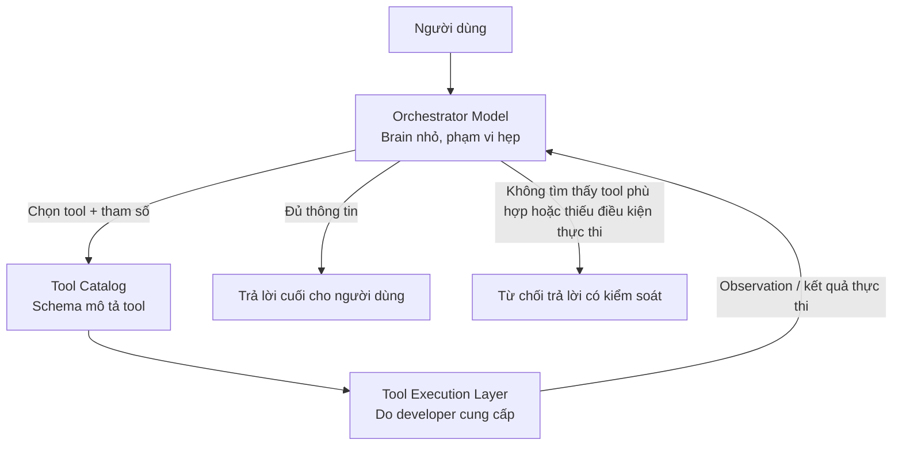
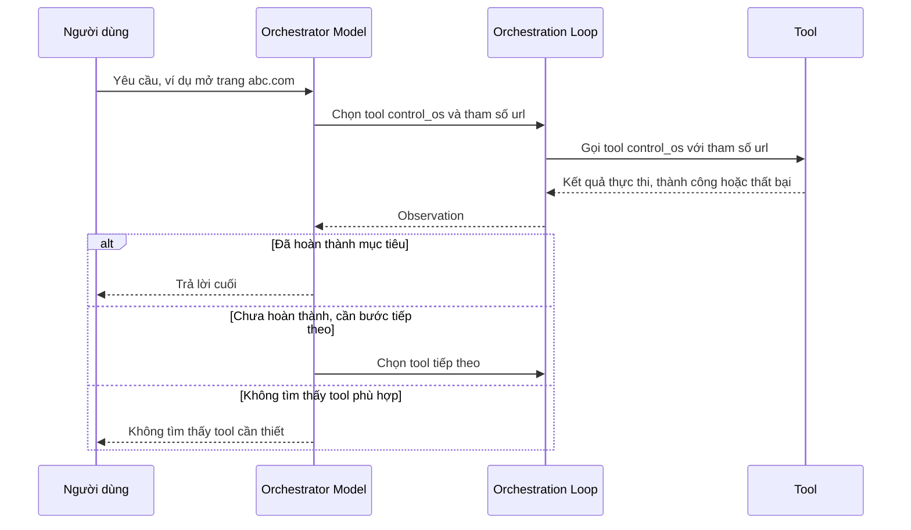
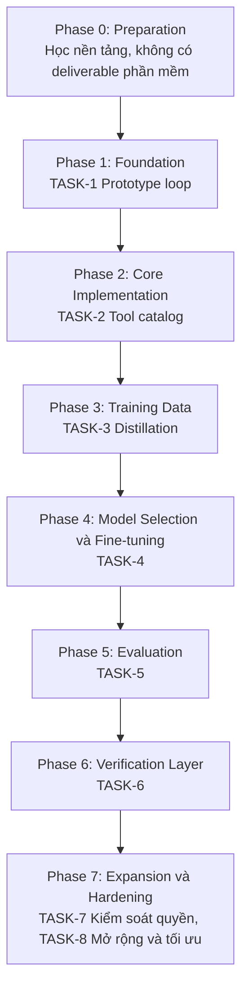

[
1. Bắt đầu với ML cổ điển trên CPU — dùng scikit-learn, làm việc với dữ liệu
dạng bảng (tabular). Vừa học được toàn bộ quy trình (data → train → evaluate → tune), 
vừa không cần GPU, vừa không cần toán quá sâu để bắt đầu (hiểu trực giác trước, công thức sau).

2. Toán cần cho ML — không cần học hết trước khi bắt đầu: 
Đại số tuyến tính (vector, ma trận), Giải tích cơ bản (đạo hàm, gradient), 
Xác suất thống kê cơ bản. Học song song với thực hành sẽ dễ vào hơn là học lý thuyết suông trước.

3. Khi cần GPU để thử deep learning: 
dùng Google Colab hoặc Kaggle Notebooks — cả hai đều cho dùng GPU miễn phí (có giới hạn giờ/ngày) để thử nghiệm, 
không cần mua card đồ họa ngay.

4. Phân biệt rõ "train từ đầu" vs "fine-tune": 
Train một model lớn từ số 0 (như GPT) cần hàng nghìn GPU và ngân sách khổng lồ — không phải hướng cho cá nhân. 
Nhưng fine-tune một model mã nguồn mở có sẵn (ví dụ các model nhỏ trên Hugging Face) 
cần tài nguyên ít hơn rất nhiều và là hướng thực tế hơn nếu mục tiêu là có "model riêng".
]

# PLAN

## 1. Document Information

- **Project name:** Lightweight Task-Routing Orchestrator (tên tạm thời — dự án chưa có tên chính thức trong hội thoại. Recommendation: đặt tên chính thức trước khi khởi tạo repository.)
- **Document purpose:** Tổng hợp toàn bộ quyết định thiết kế, đề xuất kỹ thuật, vấn đề đã phát hiện, và câu hỏi còn để ngỏ từ giai đoạn ý tưởng (ideation) của dự án, làm cơ sở để một developer có thể bắt đầu triển khai mà không cần đọc lại toàn bộ cuộc hội thoại gốc.
- **Current status:** Ideation / Pre-implementation. Chưa có dòng code nào được viết dựa trên các thảo luận này.
- **Created date:** 2026-08-12
- **Last updated:** 2026-08-12
- **Revision:** v2 — đã rà soát lại toàn bộ tài liệu: bổ sung TASK-7 (kiểm soát quyền cho tool nhạy cảm) và TASK-8 (mở rộng và tối ưu tốc độ), hoàn thiện đầy đủ các trường của component Verification Layer, chuẩn hoá cú pháp các sơ đồ Mermaid, và bổ sung liên kết còn thiếu giữa Risk/Open Question/Task.
- **Owner:** Unknown (chưa xác định trong hội thoại)
- **Related repositories:** Unknown
- **Related documents:** Unknown

---

## 2. Project Overview

### Vấn đề cần giải quyết

Người dùng muốn xây dựng một mô hình trí tuệ nhân tạo (Artificial Intelligence — AI) có phạm vi rất hẹp, chuyên biệt cho việc: phân tích ý định người dùng, chia nhỏ yêu cầu thành các bước cần thiết, và gọi đúng công cụ (tool) — do developer cung cấp — để thực hiện thao tác thực tế. Ví dụ điển hình đã thảo luận: mở một trang web trên máy, xem giờ hệ thống, tra cứu thời tiết.

### Vì sao cần dự án này

Theo lập luận của người dùng trong hội thoại: các mô hình AI đa dụng (general-purpose) hiện tại thường lớn, tốn phần cứng, chậm, và có xu hướng "hallucination" — tự tin trả lời sai — khi được giao nhiệm vụ vừa suy luận vừa quyết định hành động. Ý tưởng cốt lõi là thu hẹp phạm vi trách nhiệm của model xuống chỉ còn một việc (phân tích + route tool), nhằm đạt tốc độ cao, yêu cầu phần cứng thấp, và độ chính xác cao hơn so với việc dùng một model đa dụng cho cùng việc đó.

### Scope (trong phạm vi)

- Phân tích ý định người dùng từ ngôn ngữ tự nhiên (intent parsing).
- Chia nhỏ yêu cầu thành các bước con khi cần (task decomposition), bao gồm cả trường hợp cần nhiều bước tuần tự (ví dụ: mở trình duyệt → kiểm tra đã vào đúng trang chưa → gọi tiếp bước khác nếu chưa xong).
- Chọn tool phù hợp nhất từ danh sách tool được cung cấp (tool routing / tool selection).
- Xử lý có kiểm soát trường hợp không có tool phù hợp, hoặc thiếu điều kiện thực thi (ví dụ: không có kết nối Internet) — trả lời rõ ràng rằng không thể xác định, thay vì suy đoán (hành vi này gọi là **abstention**).

### Out of scope

- Model không cần chứa kiến thức tổng quát rộng (general knowledge) trong tham số — kiến thức được offload ra ngoài thông qua tool tra cứu.
- Model không tự thực thi tool trực tiếp — việc thực thi thuộc về tầng điều phối (orchestration loop) và các tool do developer viết.
- **(Proposed, chưa quyết định)** Việc tự đánh giá đúng/sai của câu trả lời cuối cùng nên tách thành một cơ chế riêng biệt với việc sinh câu trả lời — xem ADR-004 ở mục Decision Log. Đây là đề xuất của quá trình thảo luận, chưa được người dùng xác nhận là quyết định cuối cùng.

### Các thành phần chính (ở mức khái niệm, chưa có thiết kế chi tiết)

1. **Orchestrator model ("brain")** — model nhỏ, tốc độ cao, phạm vi hẹp.
2. **Tool catalog** — danh sách tool kèm mô tả/metadata, mà theo Recommendation nên nằm ngoài trọng số của model (xem ADR-005).
3. **Orchestration loop** — vòng lặp code điều phối việc gọi model, gọi tool, xử lý kết quả, quyết định bước tiếp theo.
4. **Tools** — do developer viết, thực thi hành động thật (điều khiển hệ điều hành, điều khiển trình duyệt, tra cứu web...).
5. **(Proposed, chưa quyết định) Verification layer** — cơ chế đánh giá độ tin cậy của kết quả trước khi trả lời cuối cùng cho người dùng.

### Mục tiêu cuối cùng

Một trợ lý AI phạm vi hẹp, chạy nhẹ (ít yêu cầu phần cứng), tốc độ cao, có khả năng mở rộng thêm tool mới mà không cần huấn luyện lại toàn bộ model, và có khả năng từ chối trả lời khi không đủ cơ sở thay vì bịa ra câu trả lời.

---

## 3. Current State

| Hạng mục | Trạng thái |
|---|---|
| Orchestrator model | Planned — chưa chọn base model, chưa fine-tune |
| Tool catalog / schema | Planned — chưa thiết kế format |
| Orchestration loop | Planned — chưa viết code |
| Tools cụ thể (control_os, web search, ...) | Planned — mới chỉ có ví dụ minh hoạ trong hội thoại, chưa implement |
| Verification layer | Planned (Proposed) — phương án cụ thể chưa được chọn |
| Training data | Planned — chưa sinh dữ liệu |
| Hạ tầng triển khai | Unknown |

Toàn bộ dự án hiện đang ở giai đoạn ý tưởng (ideation). Không có phần nào được đánh dấu Implemented hoặc Blocked vì chưa có nỗ lực triển khai nào được ghi nhận trong hội thoại.

---

## 4. Architecture



**Giải thích thành phần:**

- **Orchestrator Model** nhận yêu cầu ngôn ngữ tự nhiên từ người dùng, phân tích ý định, và quyết định: (a) gọi tool nào với tham số gì, hoặc (b) đã đủ thông tin để trả lời, hoặc (c) không tìm được tool phù hợp.
- **Tool Catalog** là danh sách các tool khả dụng kèm mô tả (Recommendation, chưa quyết định: nên là dữ liệu nằm ngoài trọng số model, đưa vào như ngữ cảnh khi gọi model — xem ADR-005).
- **Tool Execution Layer** thực thi hành động thật (ví dụ: gọi API hệ điều hành, gọi API trình duyệt, gọi công cụ tìm kiếm web) và trả kết quả về dưới dạng observation.
- **Vòng lặp (loop)**: Orchestrator → Tool → Observation → quay lại Orchestrator, lặp lại cho tới khi đủ thông tin để trả lời hoặc xác định không thể hoàn thành.

**Protocol giao tiếp giữa các thành phần:** Chưa xác định (Decision required — xem Open Question OQ-5 về format schema tool).

**Failure boundary:** Có hai lớp lỗi tách biệt, cần được xử lý ở hai tầng khác nhau (chi tiết tại mục 11, mục P4):
1. Lỗi ở tầng quyết định (model không tìm được tool phù hợp với ý định).
2. Lỗi ở tầng thực thi (tool được chọn đúng nhưng gặp lỗi runtime, ví dụ mất kết nối mạng).

**(Proposed, chưa quyết định)** Một thành phần Verification/Verifier có thể được thêm vào giữa Tool Execution Layer và Final Answer để đánh giá độ tin cậy trước khi trả lời — xem ADR-004. Thành phần này chưa được đưa vào sơ đồ chính thức vì phương án cụ thể chưa được quyết định.

---

## 5. Repository / Project Structure

Chưa xác định. Decision required — cấu trúc repository chưa được thảo luận trong hội thoại.

---

## 6. Technology Stack

| Component | Technology | Version | Purpose | Status |
|---|---|---|---|---|
| Orchestrator base model | Not specified | Not specified | "Brain" quyết định gọi tool | Decision required. Recommendation: model nền mã nguồn mở cỡ 0.5B–3B tham số (xem ADR-001) |
| Fine-tuning method | Not specified | Not specified | Huấn luyện chuyên biệt cho orchestrator | Recommendation: Low-Rank Adaptation (LoRA) hoặc Quantized Low-Rank Adaptation (QLoRA) — xem ADR-002 |
| Ngôn ngữ lập trình cho orchestration loop | Not specified | - | Điều phối gọi model + gọi tool | Decision required |
| Runtime thực thi tool | Not specified | - | Chạy tool thật (control_os, web search...) | Decision required |
| Phương pháp sinh training data | Not specified | - | Tạo dữ liệu huấn luyện | Recommendation: distillation từ model lớn có sẵn — xem ADR-003 |
| Cơ chế verification | Not specified | - | Đánh giá độ tin cậy trước khi trả lời | Proposed, chưa chọn phương án cuối — xem ADR-004 |
| Hạ tầng huấn luyện (compute) | Not specified | - | Fine-tune model | Recommendation: một Graphics Processing Unit (GPU) tiêu dùng 8–16GB VRAM, hoặc Google Colab / Kaggle miễn phí cho giai đoạn thử nghiệm |
| Cơ chế kiểm soát quyền cho tool nhạy cảm (permission control) | Not specified | - | Whitelist hành động + xác nhận người dùng cho tool có khả năng gây tác động thật (ví dụ điều khiển hệ điều hành) | Decision required — xem TASK-7, OQ-6 |

---

## 7. System Components

### Component: Orchestrator Model

**Purpose:** Phân tích yêu cầu người dùng và quyết định hành động tiếp theo (gọi tool / trả lời / từ chối).

**Responsibilities:**
- Phân tích ý định từ ngôn ngữ tự nhiên.
- Chọn tool phù hợp nhất từ tool catalog được cung cấp trong ngữ cảnh.
- Sinh tham số đúng định dạng cho tool được chọn.
- Nhận diện khi nào đã đủ thông tin để trả lời.
- Nhận diện khi nào không có tool phù hợp (trả về trạng thái "no_tool_match" thay vì đoán).

**Input:** Yêu cầu người dùng (văn bản) + tool catalog (ngữ cảnh) + lịch sử observation của các bước trước (nếu là tác vụ nhiều bước).

**Output:** Một trong ba dạng: (a) lệnh gọi tool có cấu trúc, (b) câu trả lời cuối, (c) trạng thái không tìm được tool phù hợp.

**Dependencies:** Tool catalog (phải có sẵn tại thời điểm suy luận).

**Failure modes:** Chọn sai tool (hallucination trong tool selection); sinh tham số sai định dạng; không nhận diện được trường hợp nên từ chối trả lời.

**Current status:** Planned. Chưa chọn base model, chưa huấn luyện.

---

### Component: Tool Catalog

**Purpose:** Cung cấp danh sách tool khả dụng và metadata mô tả từng tool cho Orchestrator Model, mà không yêu cầu huấn luyện lại model khi danh sách thay đổi.

**Responsibilities:**
- Lưu trữ schema mô tả mỗi tool: tên, mục đích, tham số đầu vào, điều kiện nên dùng / không nên dùng.
- **(Recommendation, xem ADR-005 và Problem P3)** Mỗi tool cần khai báo tường minh độ tin cậy và phạm vi phù hợp (ví dụ: tool đọc giờ hệ thống đáng tin hơn tool tìm kiếm web cho câu hỏi giờ hiện tại), để tránh model tự suy luận sai lệch từ xác suất ngầm trong dữ liệu huấn luyện.

**Input:** Định nghĩa tool do developer khai báo.

**Output:** Schema tool được đưa vào ngữ cảnh mỗi lần gọi Orchestrator Model.

**Dependencies:** Không phụ thuộc vào trọng số của Orchestrator Model (đây là điều kiện tiên quyết để đạt mục tiêu "mở rộng cao" mà người dùng đã nêu).

**Failure modes:** Metadata tool mô tả không chính xác dẫn đến model chọn sai; schema không nhất quán giữa các tool.

**Current status:** Planned. Format schema chưa được quyết định (xem OQ-5).

---

### Component: Orchestration Loop

**Purpose:** Điều phối toàn bộ vòng lặp: gọi Orchestrator Model → thực thi tool được chọn → trả observation về model → lặp lại tới khi hoàn thành.

**Responsibilities:**
- Gọi Orchestrator Model với ngữ cảnh phù hợp.
- Thực thi tool được chọn thông qua Tool Execution Layer.
- Bắt và phân loại lỗi runtime (timeout, mất kết nối mạng, tool báo lỗi).
- Đưa lỗi runtime trở lại model dưới dạng observation, không để model phải tự đoán trước các lỗi này.
- Giới hạn số bước lặp tối đa cho một tác vụ (để tránh vòng lặp vô hạn).

**Input:** Yêu cầu ban đầu từ người dùng.

**Output:** Câu trả lời cuối cùng hoặc thông báo không thể hoàn thành.

**Dependencies:** Orchestrator Model, Tool Catalog, Tool Execution Layer.

**Failure modes:** Vòng lặp không có điều kiện dừng rõ ràng; lỗi runtime bị model hiểu nhầm là lỗi logic.

**Current status:** Planned. Chưa có code.

---

### Component: Tool Execution Layer (Tools)

**Purpose:** Thực thi hành động thật trên hệ thống (điều khiển hệ điều hành, điều khiển trình duyệt, tra cứu web...).

**Responsibilities:** Nhận tham số có cấu trúc từ Orchestration Loop, thực thi hành động, trả kết quả hoặc lỗi.

**Input:** Tham số có cấu trúc (đã được Orchestrator Model sinh ra).

**Output:** Kết quả thực thi hoặc mã lỗi runtime.

**Dependencies:** Môi trường thực thi cụ thể (hệ điều hành, trình duyệt, kết nối mạng) — tuỳ tool.

**Failure modes:** Mất kết nối mạng, tool timeout, quyền truy cập bị từ chối, tham số không hợp lệ.

**Current status:** Planned. Mới có ví dụ minh hoạ (control_os, get_time, web_search) trong hội thoại, chưa implement.

---

### Component: Verification Layer (Proposed — chưa quyết định)

**Purpose:** Đánh giá độ tin cậy của câu trả lời/kết quả trước khi trả về người dùng, thay thế cho việc dùng trực tiếp xác suất token thô của model (vốn không phản ánh đúng độ chính xác thực tế — xem Problem P2).

**Responsibilities (đề xuất, chưa chốt phương án):** Một trong các hướng sau, cần quyết định tại ADR-004:
- Self-consistency: sinh nhiều câu trả lời độc lập, đo mức đồng thuận.
- Bắt buộc ground bằng retrieval: mọi câu trả lời chứa dữ kiện phải bám vào kết quả tool/tra cứu thật, không cho phép trả lời từ trí nhớ tham số.
- Verifier model riêng: một model nhỏ thứ hai, tách biệt, chỉ làm nhiệm vụ đọc câu trả lời + bằng chứng và phán đúng/sai.

**Input:** Câu trả lời/kết quả dự kiến trả về người dùng, kèm bằng chứng liên quan (kết quả tool đã thực thi trong quá trình xử lý yêu cầu).

**Output:** Một nhãn đánh giá độ tin cậy (ví dụ: đủ tin cậy để trả lời / cần tra cứu thêm / nên từ chối trả lời), tuỳ theo phương án được chọn ở ADR-004.

**Dependencies:** Orchestrator Model (nguồn câu trả lời cần kiểm chứng). Tuỳ phương án được chọn ở ADR-004, có thể phụ thuộc thêm vào Tool Execution Layer (nếu chọn hướng bắt buộc ground bằng retrieval) hoặc một model thứ hai độc lập (nếu chọn hướng verifier model riêng).

**Failure modes:** Bản thân verifier cũng có thể đánh giá sai (không có cơ chế nào đảm bảo tuyệt đối); độ trễ tăng thêm do bước kiểm chứng bổ sung, có thể mâu thuẫn với mục tiêu tốc độ ban đầu của dự án (xem TASK-6, Possible Problems).

**Current status:** Proposed. Chưa được người dùng xác nhận là quyết định cuối cùng — đây là Open Question OQ-2, blocking cho Phase 6.

---

## 8. Data Flow



**Mô tả từng bước:**

- **Step 1 — Input:** Người dùng gửi yêu cầu bằng ngôn ngữ tự nhiên.
- **Step 2 — Validation:** Chưa xác định cơ chế validate đầu vào cụ thể (Decision required).
- **Step 3 — Processing:** Orchestrator Model phân tích và chọn tool + tham số, hoặc xác định trạng thái no_tool_match.
- **Step 4 — Persistence:** Không áp dụng ở giai đoạn hiện tại — hệ thống được mô tả là không có yêu cầu lưu trữ trạng thái lâu dài trong hội thoại.
- **Step 5 — Response:** Trả lời cuối cùng hoặc thông báo không thể hoàn thành.
- **Step 6 — Error handling:** Lỗi runtime (mất mạng, tool lỗi) được Orchestration Loop bắt lại và đưa về model dưới dạng observation, theo nguyên tắc tách bạch đã nêu ở Problem P4.

---

## 9. Implementation Plan

> Lưu ý: các phase dưới đây được xây dựng dựa trên định hướng đã thảo luận trong hội thoại (bắt đầu bằng prototype không cần huấn luyện, sau đó mới huấn luyện). Đây là đề xuất trình tự, cần người dùng xác nhận trước khi thực thi.

- **Phase 0 — Preparation (không có deliverable phần mềm):** Học nền tảng cần thiết — đại số tuyến tính ở mức trực giác, xác suất cơ bản, khái niệm gradient descent. Đây là hoạt động học tập cá nhân, không tạo ra task kỹ thuật cụ thể nên không được liệt kê dưới dạng TASK ở mục 10.
- **Phase 1 — Foundation:** Dựng agent loop prototype bằng một model có sẵn (qua giao diện lập trình ứng dụng — Application Programming Interface, viết tắt API — của một model lớn), chưa huấn luyện gì. Xem TASK-1.
- **Phase 2 — Core Implementation (Tool Catalog):** Thiết kế schema mô tả tool, đảm bảo nằm ngoài trọng số model. Xem TASK-2.
- **Phase 3 — Training Data Generation:** Sinh dữ liệu huấn luyện bằng kỹ thuật distillation. Xem TASK-3.
- **Phase 4 — Model Selection & Fine-tuning:** Chọn base model nền nhỏ, fine-tune bằng LoRA/QLoRA. Xem TASK-4.
- **Phase 5 — Evaluation:** Xây khung đánh giá, đo tỷ lệ gọi đúng tool và tỷ lệ hoàn thành tác vụ. Xem TASK-5.
- **Phase 6 — Verification Layer:** Quyết định và triển khai cơ chế verification (giải quyết OQ-2 / ADR-004). Xem TASK-6.
- **Phase 7 — Expansion & Hardening:** Kiểm soát quyền cho tool nhạy cảm trước khi kết nối với hành động thật (xem TASK-7); mở rộng thêm tool và tối ưu tốc độ bằng quantization (xem TASK-8).

---

## 10. Tasks

### TASK-1 — Xây dựng agent loop prototype bằng model có sẵn

**Objective:** Dựng một vòng lặp agent hoạt động đầy đủ (nhận input → gọi tool → đọc kết quả → lặp lại) bằng cách dùng model lớn có sẵn qua API, chưa huấn luyện model riêng.

**Why:** Xác nhận thiết kế tool + luồng quyết định hoạt động đúng trước khi đầu tư công sức huấn luyện một model chuyên biệt. Tránh lãng phí nếu thiết kế ban đầu có lỗ hổng.

**Prerequisites:** Quyết định OQ-1 (single-step router hay multi-step planner) và OQ-4 (ngôn ngữ lập trình).

**Dependencies:** Không phụ thuộc task nào khác — đây là task khởi đầu.

**Inputs:** Truy cập API của một model có hỗ trợ function calling; 2–3 tool giả lập.

**Implementation:**
```text
Step 1: Định nghĩa 2-3 tool tối thiểu (ví dụ: get_time, search_web, control_os) dưới dạng hàm giả lập.
Step 2: Viết vòng lặp gọi model với ngữ cảnh gồm yêu cầu người dùng + danh sách tool.
Step 3: Xử lý output của model: nếu là lệnh gọi tool thì thực thi, nếu là câu trả lời cuối thì dừng vòng lặp.
Step 4: Thêm giới hạn số bước lặp tối đa để tránh vòng lặp vô hạn.
Step 5: Thử nghiệm với các ví dụ đã nêu trong hội thoại (mở web, xem giờ, xem thời tiết, trường hợp không có tool phù hợp).
```

**Expected Result:** Một prototype chạy được cục bộ, minh hoạ đúng luồng đã mô tả ở mục 4 và mục 8.

**Possible Problems:**
```text
Problem: Model có sẵn chọn sai tool trong tình huống mơ hồ.
Cause: Mô tả tool trong ngữ cảnh chưa đủ rõ ràng.
Detection: Quan sát log lựa chọn tool trong quá trình test thủ công.
Solution: Viết lại mô tả tool rõ ràng hơn, bổ sung ví dụ trong schema.
```

**Error Handling:** Nếu tool trả lỗi runtime (ví dụ mất mạng giả lập), vòng lặp phải bắt lỗi và đưa observation lỗi về model, không để chương trình crash.

**Security Considerations:** Vì đây là prototype dùng tool giả lập, rủi ro bảo mật thấp. Nếu tool giả lập có mô phỏng điều khiển hệ điều hành, cần giới hạn phạm vi hành động được phép mô phỏng.

**Performance Considerations:** Không đặt nặng ở giai đoạn này vì mục tiêu là xác thực logic, không phải đo hiệu năng.

**Testing:**
```text
Integration Test: Chạy thử toàn bộ vòng lặp với các ví dụ đã nêu trong hội thoại.
Failure Test: Giả lập tool trả lỗi, giả lập không có tool phù hợp.
```

**Acceptance Criteria:**
```text
- Vòng lặp xử lý đúng cả 3 ví dụ: mở web, xem giờ, xem thời tiết.
- Vòng lặp trả về "không tìm thấy tool phù hợp" khi không có tool khớp ý định.
- Vòng lặp không bị treo vô hạn khi tool liên tục lỗi.
```

**Deliverables:**
```text
Files: mã nguồn agent loop prototype, mã nguồn tool giả lập.
APIs: Không áp dụng (nội bộ).
Documentation: Ghi chú kết quả thử nghiệm.
```

**Priority:** P0 — Blocking / Critical (mọi phase sau phụ thuộc vào việc xác thực thiết kế ở bước này).

**Estimation:** Chưa ước lượng thời gian do chưa có đủ thông tin (ngôn ngữ lập trình, kinh nghiệm cụ thể của người thực hiện). *Assumption nếu cần ước lượng: người thực hiện đã quen thuộc với việc gọi API function calling.*

**Traceability:** Requirement: mô tả hành vi mong muốn trong hội thoại gốc (ví dụ mở web, xem giờ). Decision: liên quan OQ-1, OQ-4.

---

### TASK-2 — Thiết kế Tool Catalog (schema mô tả tool)

**Objective:** Xây dựng định dạng chuẩn để khai báo tool, đảm bảo tool catalog nằm ngoài trọng số model.

**Why:** Đây là điều kiện tiên quyết để đạt mục tiêu "mở rộng cao" mà người dùng đặt ra — nếu không, mỗi lần thêm tool mới sẽ cần huấn luyện lại toàn bộ model (xem Risk R5).

**Prerequisites:** Quyết định OQ-5 (format schema: tự định nghĩa hay theo chuẩn function-calling có sẵn).

**Dependencies:** Không bắt buộc phụ thuộc TASK-1, nhưng nên làm song song hoặc ngay sau đó vì TASK-1 cần một schema tool tối thiểu.

**Inputs:** Danh sách tool dự kiến (control_os, get_time, search_web, và các tool mở rộng sau này).

**Implementation:**
```text
Step 1: Liệt kê các trường bắt buộc cho mỗi tool: tên, mô tả mục đích, tham số đầu vào, điều kiện nên dùng/không nên dùng.
Step 2: Bổ sung trường metadata về độ tin cậy và độ trễ dự kiến cho mỗi tool (xem Problem P3 — tránh model tự suy luận sai lệch giữa các tool có chức năng tương tự, ví dụ giữa đọc đồng hồ hệ thống và tìm kiếm web).
Step 3: Viết schema mẫu cho 2-3 tool ban đầu.
Step 4: Validate schema bằng cách đưa vào TASK-1 để kiểm tra model chọn đúng tool.
```

**Expected Result:** Một định dạng schema có thể mở rộng, thêm tool mới không cần sửa đổi model.

**Possible Problems:**
```text
Problem: Metadata mô tả tool không đủ rõ khiến model chọn nhầm giữa hai tool có chức năng gần giống nhau.
Cause: Thiếu tiêu chí phân biệt tường minh (ví dụ độ tin cậy, phạm vi phù hợp).
Detection: Phát hiện qua test ở TASK-1 và TASK-5.
Solution: Bổ sung trường "khi nào nên dùng / khi nào không nên dùng" tường minh trong schema, thay vì để model tự suy luận từ xác suất ngầm.
```

**Error Handling:** Không áp dụng trực tiếp (đây là task thiết kế dữ liệu tĩnh, không có runtime error).

**Security Considerations:** Với các tool có khả năng gây tác động thật (ví dụ điều khiển hệ điều hành), schema nên có trường khai báo mức độ nhạy cảm để phục vụ TASK liên quan đến bảo mật sau này (xem Open Question OQ-6).

**Performance Considerations:** Không áp dụng trực tiếp ở giai đoạn thiết kế.

**Testing:**
```text
Unit Test: Validate cấu trúc schema đúng định dạng đã chọn.
Integration Test: Đưa schema vào TASK-1 prototype để kiểm tra model chọn đúng tool trên tập ví dụ.
```

**Acceptance Criteria:**
```text
- Có thể thêm một tool mới chỉ bằng cách thêm entry mới vào catalog, không cần sửa code hay huấn luyện lại.
- Model trong TASK-1 chọn đúng tool trên các ví dụ đã có trong hội thoại, bao gồm cả trường hợp đã bị chỉ ra là dễ nhầm (câu hỏi về giờ hiện tại).
```

**Deliverables:**
```text
Files: định nghĩa schema (định dạng cụ thể chưa xác định).
Documentation: hướng dẫn thêm tool mới vào catalog.
```

**Priority:** P0 — Blocking / Critical.

**Estimation:** Chưa ước lượng do chưa xác định format schema cụ thể.

**Traceability:** Decision: ADR-005. Problem: P3, P4. Depends on: liên quan trực tiếp TASK-1.

---

### TASK-3 — Sinh dữ liệu huấn luyện bằng distillation

**Objective:** Tạo tập dữ liệu huấn luyện gồm các ví dụ: tình huống → suy nghĩ → tool được chọn → tham số → kết quả → bước tiếp theo, dùng để fine-tune orchestrator model.

**Why:** Tự viết tay dữ liệu huấn luyện với số lượng đủ lớn không khả thi về mặt thời gian; dùng một model lớn có sẵn để sinh dữ liệu mẫu là phương pháp phổ biến và hiệu quả hơn (Recommendation, ADR-003).

**Prerequisites:** TASK-2 hoàn thành (cần có tool catalog để sinh ví dụ hợp lệ).

**Dependencies:** TASK-2.

**Inputs:** Tool catalog từ TASK-2; quyền truy cập một model lớn có khả năng suy luận tốt để đóng vai trò "giáo viên" (teacher model).

**Implementation:**
```text
Step 1: Viết prompt cho teacher model để sinh ra các tình huống người dùng đa dạng (bao gồm cả trường hợp rõ ràng và trường hợp mơ hồ dễ nhầm tool).
Step 2: Với mỗi tình huống, yêu cầu teacher model sinh chuỗi quyết định đầy đủ: phân tích → chọn tool → tham số → quan sát kết quả → bước tiếp theo (nếu multi-step).
Step 3: Bổ sung có chủ đích các ví dụ về trường hợp nên từ chối (no_tool_match, mất kết nối mạng) để dạy hành vi abstention.
Step 4: Kiểm tra thủ công một mẫu ngẫu nhiên của dữ liệu sinh ra để đánh giá chất lượng trước khi dùng toàn bộ.
```

**Expected Result:** Một tập dữ liệu có cấu trúc, đủ đa dạng, sẵn sàng cho việc fine-tune ở TASK-4.

**Possible Problems:**
```text
Problem: Dữ liệu sinh ra bị thiên lệch (teacher model có xu hướng chọn một tool quen thuộc quá thường xuyên).
Cause: Prompt sinh dữ liệu chưa đủ đa dạng về tình huống.
Detection: Thống kê phân phối tool được chọn trong tập dữ liệu.
Solution: Điều chỉnh prompt để cân bằng số lượng ví dụ giữa các tool và các trường hợp từ chối.
```

**Error Handling:** Không áp dụng trực tiếp (đây là quá trình sinh dữ liệu offline).

**Security Considerations:** Không sinh dữ liệu chứa thông tin nhạy cảm hoặc thông tin cá nhân thật trong các ví dụ mẫu.

**Performance Considerations:** Số lượng ví dụ cần thiết chưa xác định — phụ thuộc vào kết quả đánh giá ở TASK-5.

**Testing:**
```text
Unit Test: Kiểm tra định dạng mỗi bản ghi dữ liệu đúng schema đã định nghĩa ở TASK-2.
```

**Acceptance Criteria:**
```text
- Tập dữ liệu bao phủ đầy đủ các tool trong catalog hiện tại.
- Tập dữ liệu có ví dụ rõ ràng cho cả hai loại lỗi: no_tool_match (lỗi tầng model) và lỗi runtime (lỗi tầng thực thi), theo đúng phân biệt ở Problem P4.
```

**Deliverables:**
```text
Files: tập dữ liệu huấn luyện (định dạng cụ thể chưa xác định).
Documentation: mô tả quy trình sinh dữ liệu, để có thể lặp lại khi mở rộng tool catalog.
```

**Priority:** P1 — Required.

**Estimation:** Chưa ước lượng do chưa xác định số lượng ví dụ cần thiết.

**Traceability:** Decision: ADR-003. Depends on: TASK-2.

---

### TASK-4 — Chọn base model và fine-tune

**Objective:** Chọn một model nền mã nguồn mở cỡ nhỏ và fine-tune nó chuyên biệt cho nhiệm vụ phân tích + route tool, dùng dữ liệu từ TASK-3.

**Why:** Train từ đầu (from scratch) không khả thi về mặt dữ liệu và compute cho một cá nhân; fine-tune một model nền đã biết ngôn ngữ giúp giảm chi phí này đáng kể (Recommendation, ADR-001, ADR-002).

**Prerequisites:** TASK-3 hoàn thành. Quyết định OQ-3 (chọn base model cụ thể).

**Dependencies:** TASK-3.

**Inputs:** Tập dữ liệu huấn luyện từ TASK-3; base model được chọn; hạ tầng compute (GPU tiêu dùng hoặc Colab/Kaggle).

**Implementation:**
```text
Step 1: Đánh giá và chọn base model cụ thể (tiêu chí: kích thước 0.5B-3B tham số, hỗ trợ tốt structured output/function calling).
Step 2: Chuẩn bị môi trường fine-tune bằng LoRA hoặc QLoRA.
Step 3: Chạy fine-tune trên tập dữ liệu từ TASK-3.
Step 4: Lưu checkpoint model đã fine-tune.
```

**Expected Result:** Một model đã fine-tune, sẵn sàng để đánh giá ở TASK-5.

**Possible Problems:**
```text
Problem: Model sau fine-tune bị overfit vào tập dữ liệu huấn luyện, không tổng quát hoá tốt với tình huống mới.
Cause: Dữ liệu huấn luyện chưa đủ đa dạng, hoặc số epoch huấn luyện quá cao.
Detection: So sánh hiệu năng trên tập train và tập eval riêng biệt (xem TASK-5).
Solution: Tăng độ đa dạng dữ liệu, áp dụng early stopping hoặc regularization phù hợp với kỹ thuật LoRA/QLoRA.
```

**Error Handling:** Không áp dụng trực tiếp (quá trình huấn luyện offline).

**Security Considerations:** Không áp dụng trực tiếp ở bước này.

**Performance Considerations:** Cần theo dõi mức sử dụng bộ nhớ video (VRAM) trong quá trình fine-tune để đảm bảo phù hợp với hạ tầng đã chọn (GPU tiêu dùng hoặc Colab miễn phí).

**Testing:**
```text
Không áp dụng trực tiếp ở task này — việc đánh giá chất lượng thuộc về TASK-5.
```

**Acceptance Criteria:**
```text
- Quá trình fine-tune hoàn thành không lỗi, tạo ra checkpoint model sử dụng được.
- Model có thể sinh output đúng định dạng structured output đã quy định ở TASK-2.
```

**Deliverables:**
```text
Files: checkpoint model đã fine-tune, script huấn luyện.
Documentation: cấu hình huấn luyện đã dùng (siêu tham số, số bước, dữ liệu).
```

**Priority:** P0 — Blocking / Critical.

**Estimation:** Chưa ước lượng do chưa chọn base model cụ thể và chưa biết kích thước tập dữ liệu.

**Traceability:** Decision: ADR-001, ADR-002. Depends on: TASK-3. Blocked by: OQ-3.

---

### TASK-5 — Xây khung đánh giá (evaluation)

**Objective:** Đo lường khách quan tỷ lệ chọn đúng tool và tỷ lệ hoàn thành tác vụ của model đã fine-tune.

**Why:** Con số "80% và tiếp tục học dần" mà người dùng đề xuất ban đầu chưa tính đến lỗi cộng dồn qua nhiều bước (xem Problem P5) — cần một khung đo lường cụ thể để biết model có thực sự đạt yêu cầu hay không, thay vì đánh giá cảm tính.

**Prerequisites:** TASK-4 hoàn thành (cần có model để đánh giá).

**Dependencies:** TASK-4.

**Inputs:** Model đã fine-tune từ TASK-4; một tập dữ liệu test riêng biệt, không trùng với tập huấn luyện ở TASK-3.

**Implementation:**
```text
Step 1: Tạo tập test riêng biệt, bao gồm cả tình huống đơn giản (1 tool) và tình huống nhiều bước.
Step 2: Đo tỷ lệ gọi đúng tool và đúng tham số trên từng bước riêng lẻ (per-step accuracy).
Step 3: Đo tỷ lệ hoàn thành đúng toàn bộ chuỗi nhiều bước (end-to-end task completion rate), có tính đến hiệu ứng lỗi cộng dồn.
Step 4: So sánh kết quả với mục tiêu đã thống nhất (xem mục 23 — Performance Targets).
```

**Expected Result:** Bộ số liệu khách quan cho biết model đã đủ tin cậy để triển khai hay cần cải thiện thêm (quay lại TASK-3 hoặc TASK-4).

**Possible Problems:**
```text
Problem: Tỷ lệ hoàn thành tác vụ nhiều bước thấp hơn nhiều so với tỷ lệ đúng từng bước.
Cause: Lỗi cộng dồn qua nhiều bước (compounding error) — ví dụ mỗi bước đúng 80% thì chuỗi 4 bước chỉ còn khoảng 41% (0.8^4).
Detection: So sánh per-step accuracy và end-to-end completion rate.
Solution: Cần đặt mục tiêu per-step accuracy cao hơn nhiều (Recommendation: trên 95%) vì phạm vi hẹp của nhiệm vụ cho phép điều đó, thay vì chấp nhận mức 80% ban đầu.
```

**Error Handling:** Không áp dụng trực tiếp.

**Security Considerations:** Không áp dụng trực tiếp.

**Performance Considerations:** Đo thêm độ trễ phản hồi (latency) của model trên hạ tầng dự kiến triển khai, vì mục tiêu ban đầu của dự án là "cực nhanh, rất nhẹ".

**Testing:**
```text
Integration Test: Chạy toàn bộ pipeline (Orchestration Loop + model đã fine-tune + tool thật hoặc giả lập) trên tập test.
Failure Test: Đo hành vi model trên các tình huống cố ý không có tool phù hợp hoặc mô phỏng mất kết nối mạng.
```

**Acceptance Criteria:**
```text
- Per-step tool-selection accuracy đạt mục tiêu đã thống nhất (xem Recommendation tại mục 23).
- Model trả về đúng trạng thái "không tìm thấy tool phù hợp" trong các trường hợp test cố ý không có tool khớp, thay vì đoán bừa.
```

**Deliverables:**
```text
Files: script đánh giá, tập dữ liệu test.
Documentation: báo cáo kết quả đánh giá.
```

**Priority:** P0 — Blocking / Critical (quyết định model có sẵn sàng triển khai hay cần lặp lại).

**Estimation:** Chưa ước lượng.

**Traceability:** Problem: P5. Depends on: TASK-4.

---

### TASK-6 — Quyết định và triển khai cơ chế Verification

**Objective:** Chọn một phương án cụ thể trong số các đề xuất (self-consistency / bắt buộc ground bằng retrieval / verifier model riêng) và triển khai nó, giải quyết Open Question OQ-2 và ADR-004.

**Why:** Xác suất token thô của model không phản ánh đúng độ chính xác thực tế (vấn đề calibration — xem Problem P2). Nếu không có cơ chế verification đáng tin cậy, model có thể "tự tin" trả lời sai mà không có cách phát hiện.

**Prerequisites:** TASK-5 hoàn thành, có số liệu cho thấy cần cải thiện độ tin cậy. Quyết định OQ-2 (chọn phương án cụ thể).

**Dependencies:** TASK-4, TASK-5.

**Inputs:** Kết quả đánh giá từ TASK-5; model đã fine-tune từ TASK-4.

**Implementation:**
```text
Step 1: Đánh giá ưu/nhược điểm của từng phương án trong bối cảnh cụ thể của dự án (xem bảng ở mục 12 — Decision Log, ADR-004).
Step 2: Chọn phương án phù hợp nhất, ghi nhận lý do lựa chọn vào Decision Log.
Step 3: Triển khai phương án đã chọn.
Step 4: Đánh giá lại độ tin cậy sau khi có verification layer, so sánh với kết quả trước đó ở TASK-5.
```

**Expected Result:** Hệ thống có khả năng phát hiện và xử lý các trường hợp có độ tin cậy thấp, thay vì trả lời một cách tự tin không có cơ sở.

**Possible Problems:**
```text
Problem: Phương án verification làm tăng đáng kể độ trễ phản hồi, mâu thuẫn với mục tiêu "cực nhanh".
Cause: Một số phương án (ví dụ self-consistency với nhiều lần sinh) tốn thêm thời gian tính toán.
Detection: Đo độ trễ trước và sau khi thêm verification layer.
Solution: Cân nhắc phương án nhẹ hơn (ví dụ bắt buộc ground bằng retrieval thay vì self-consistency nhiều lần sinh), hoặc chỉ kích hoạt verification cho các trường hợp có rủi ro cao (ví dụ tool có khả năng gây tác động thật lên hệ thống).
```

**Error Handling:** Không áp dụng trực tiếp.

**Security Considerations:** Với các tool có khả năng gây tác động thật (điều khiển hệ điều hành), Recommendation là verification/xác nhận nên là bắt buộc, không tuỳ chọn.

**Performance Considerations:** Cần đo lại độ trễ tổng thể sau khi thêm verification layer.

**Testing:**
```text
Integration Test: Kiểm tra verification layer phát hiện đúng các trường hợp đã biết là mơ hồ/dễ sai (ví dụ ví dụ về giờ hệ thống ở Problem P3).
```

**Acceptance Criteria:**
```text
- Phương án verification được chọn và ghi nhận lý do trong Decision Log.
- Hệ thống giảm được tỷ lệ trả lời sai một cách tự tin so với baseline ở TASK-5 (không đặt con số cụ thể do chưa có baseline).
```

**Deliverables:**
```text
Files: mã nguồn verification layer.
Documentation: cập nhật ADR-004 với quyết định cuối cùng và lý do.
```

**Priority:** P1 — Required (không blocking cho việc có một prototype hoạt động, nhưng blocking cho việc coi hệ thống là đáng tin cậy để sử dụng thật).

**Estimation:** Chưa ước lượng, phụ thuộc vào phương án được chọn.

**Traceability:** Decision: ADR-004. Problem: P2. Depends on: TASK-4, TASK-5. Blocked by: OQ-2.

---

### TASK-7 — Kiểm soát quyền cho tool nhạy cảm (ví dụ: điều khiển hệ điều hành)

**Objective:** Xây dựng cơ chế giới hạn quyền, danh sách hành động được phép (whitelist), và xác nhận từ người dùng trước khi một tool có khả năng gây tác động thật lên hệ thống (ví dụ điều khiển hệ điều hành) được phép thực thi.

**Why:** Risk R3 đã xác định rủi ro bảo mật với impact cao ở loại tool này. Đây là điều kiện cần trước khi chuyển một tool từ dạng giả lập (dùng trong TASK-1) sang thực thi hành động thật trên máy người dùng.

**Prerequisites:** TASK-2 hoàn thành (schema tool cần có trường khai báo mức độ nhạy cảm). Quyết định OQ-6.

**Dependencies:** TASK-2. Task này không bắt buộc phải hoàn thành trước Phase 1–6 nếu các phase đó chỉ dùng tool giả lập, nhưng bắt buộc phải hoàn thành trước khi bất kỳ tool nhạy cảm nào được kết nối với hành động thật.

**Inputs:** Danh sách hành động cụ thể mà tool nhạy cảm cần thực hiện (chưa xác định trong hội thoại — Decision required); schema tool từ TASK-2.

**Implementation:**
```text
Step 1: Liệt kê danh sách hành động được phép (whitelist) cho từng tool nhạy cảm.
Step 2: Thiết kế cơ chế xác nhận từ người dùng cho hành động nhạy cảm trước khi thực thi.
Step 3: Áp dụng nguyên tắc quyền tối thiểu (least privilege) khi cấp quyền cho tool.
Step 4: Thêm bước input validation cho tham số truyền vào tool nhạy cảm, nhằm tránh việc thực thi lệnh hệ thống ngoài ý muốn.
```

**Expected Result:** Tool nhạy cảm chỉ có thể thực thi hành động nằm trong whitelist đã khai báo, và luôn có bước xác nhận trước khi thực thi hành động có rủi ro.

**Possible Problems:**
```text
Problem: Whitelist quá chặt khiến tool không đủ linh hoạt để đáp ứng yêu cầu thực tế của người dùng.
Cause: Danh sách hành động hợp lệ ban đầu chưa liệt kê đủ.
Detection: Người dùng gặp tình huống tool từ chối một hành động hợp lệ trong quá trình sử dụng thực tế.
Solution: Mở rộng whitelist theo yêu cầu thực tế, có xem xét (review) thủ công trước khi thêm — không tự động mở rộng.
```

**Error Handling:** Nếu hành động nằm ngoài whitelist, tool phải từ chối thực thi hoàn toàn và trả lỗi rõ ràng cho Orchestration Loop — không được thực thi một phần của hành động.

**Security Considerations:** Đây là task an ninh cốt lõi của dự án — áp dụng đồng thời least privilege, input validation, whitelist hành động, và xác nhận người dùng cho hành động nhạy cảm.

**Performance Considerations:** Bước xác nhận từ người dùng sẽ làm tăng độ trễ cho các hành động nhạy cảm. Recommendation: chỉ áp dụng xác nhận bắt buộc cho hành động thực sự có rủi ro, không áp dụng cho mọi lệnh gọi tool, để không mâu thuẫn với mục tiêu "cực nhanh".

**Testing:**
```text
Security Test: Gọi tool với hành động ngoài whitelist, xác nhận tool từ chối đúng cách.
Security Test: Gọi tool với tham số có dấu hiệu không hợp lệ, xác nhận input validation chặn đúng.
Integration Test: Xác nhận bước xác nhận người dùng được kích hoạt đúng lúc cho hành động nhạy cảm.
```

**Acceptance Criteria:**
```text
- Tool nhạy cảm không thể thực thi hành động ngoài whitelist đã khai báo.
- Hành động nhạy cảm yêu cầu xác nhận từ người dùng trước khi thực thi.
- Tham số đầu vào được validate trước khi thực thi.
```

**Deliverables:**
```text
Files: cơ chế whitelist, cơ chế xác nhận người dùng, input validation cho tool nhạy cảm.
Documentation: danh sách hành động được whitelist và lý do lựa chọn.
```

**Priority:** P1 — Required (blocking riêng cho việc kết nối tool nhạy cảm với hành động thật; không blocking cho Phase 1–6 nếu các phase đó chỉ dùng tool giả lập).

**Estimation:** Chưa ước lượng do chưa có danh sách hành động cụ thể cần whitelist.

**Traceability:** Risk: R3. Open Question: OQ-6. Depends on: TASK-2.

---

### TASK-8 — Mở rộng Tool Catalog và tối ưu tốc độ (quantization)

**Objective:** Thêm tool mới vào hệ thống theo nhu cầu thực tế, và tối ưu tốc độ suy luận của model đã fine-tune để giữ đúng mục tiêu "cực nhanh, rất nhẹ" đã nêu từ đầu dự án.

**Why:** "Mở rộng cao" là một trong những mục tiêu cốt lõi người dùng đặt ra. Đây là bước chứng minh khả năng mở rộng thực tế sau khi phiên bản đầu tiên (TASK-1 đến TASK-6) đã hoạt động ổn định, đồng thời tối ưu hiệu năng trước khi đưa vào sử dụng lâu dài.

**Prerequisites:** TASK-5 (Evaluation) và TASK-6 (Verification) đã hoàn thành với kết quả đạt mục tiêu đã thống nhất.

**Dependencies:** TASK-2, TASK-4, TASK-5, TASK-6.

**Inputs:** Yêu cầu về tool mới cụ thể (chưa xác định — sẽ phát sinh theo nhu cầu sử dụng thực tế); model checkpoint từ TASK-4.

**Implementation:**
```text
Step 1: Thêm entry tool mới vào Tool Catalog theo schema đã có ở TASK-2, không sửa đổi model.
Step 2: Đánh giá lại hiệu năng model trên tool mới bằng khung đánh giá từ TASK-5; nếu tool mới đủ khác biệt, bổ sung dữ liệu huấn luyện tương ứng (quay lại TASK-3).
Step 3: Áp dụng kỹ thuật quantization cho model đã fine-tune để giảm kích thước và tăng tốc độ suy luận.
Step 4: Đo lại độ trễ và độ chính xác sau khi quantize, đối chiếu với kết quả trước quantization.
```

**Expected Result:** Hệ thống hỗ trợ thêm tool mới mà không cần huấn luyện lại toàn bộ model, và chạy nhanh hơn/nhẹ hơn sau khi tối ưu.

**Possible Problems:**
```text
Problem: Quantization làm giảm đáng kể độ chính xác chọn tool.
Cause: Model nhạy cảm với việc giảm độ chính xác số học khi lượng tử hoá trọng số.
Detection: So sánh accuracy trước/sau quantization trên cùng tập eval đã dùng ở TASK-5.
Solution: Thử mức quantization nhẹ hơn, hoặc chỉ quantize các phần ít nhạy cảm hơn của model.
```

**Error Handling:** Không áp dụng trực tiếp.

**Security Considerations:** Nếu tool mới thuộc loại nhạy cảm (có khả năng gây tác động thật), phải áp dụng lại quy trình ở TASK-7 trước khi kích hoạt tool đó.

**Performance Considerations:** Đây là trọng tâm chính của task — đo độ trễ, kích thước model, và mức sử dụng bộ nhớ trước/sau quantization.

**Testing:**
```text
Performance Test: So sánh độ trễ và kích thước model trước/sau quantization.
Integration Test: Kiểm tra tool mới hoạt động đúng trong toàn bộ vòng lặp.
```

**Acceptance Criteria:**
```text
- Thêm tool mới không yêu cầu huấn luyện lại toàn bộ model.
- Độ chính xác sau quantization không giảm đáng kể so với mục tiêu đã đạt ở TASK-5 (ngưỡng cụ thể: Decision required).
```

**Deliverables:**
```text
Files: model đã quantize, Tool Catalog đã cập nhật.
Documentation: báo cáo so sánh hiệu năng trước/sau tối ưu.
```

**Priority:** P2 — Important (cải thiện sau khi hệ thống đã hoạt động ổn định ở mức tối thiểu khả dụng).

**Estimation:** Chưa ước lượng.

**Traceability:** Depends on: TASK-2, TASK-4, TASK-5, TASK-6.

---

## 11. Problem / Solution Register

| ID | Problem | Root Cause | Impact | Solution | Status |
|---|---|---|---|---|---|
| P1 | Ý định ban đầu là "train model từ đầu" | Chưa phân biệt giữa train from scratch và fine-tune một model nền có sẵn | Có thể lãng phí lớn về dữ liệu và compute nếu cố train from scratch | Fine-tune một base model nền nhỏ có sẵn (0.5B–3B tham số) bằng LoRA/QLoRA | Resolved trong định hướng (chưa implement) |
| P2 | Đề xuất dùng % xác suất token để quyết định khi nào cần tra cứu thêm | Xác suất sinh token phản ánh "mức độ giống pattern đã học", không phản ánh độ đúng của sự thật (vấn đề calibration) | Threshold dựa theo confidence thô sẽ bỏ lọt chính xác các trường hợp model tự tin nhưng sai (hallucination tự tin) | Dùng self-consistency, hoặc bắt buộc ground bằng retrieval, hoặc verifier model riêng — xem ADR-004 | Proposed, chưa chọn phương án cuối |
| P3 | Ví dụ minh hoạ: cho rằng đọc giờ từ hệ điều hành "có thể lệch" nên ưu tiên tìm kiếm web | Hiểu chưa đúng về độ tin cậy tương đối: đồng hồ hệ thống thường được đồng bộ hoá qua giao thức mạng thời gian (Network Time Protocol — NTP) nên đáng tin và tức thời hơn kết quả tìm kiếm web | Nếu association sai này bị đưa vào dữ liệu huấn luyện, model sẽ học cách chọn sai tool trong các tình huống tương tự | Khai báo metadata tường minh cho từng tool (độ tin cậy, độ trễ, phạm vi phù hợp) trong tool catalog, không để model tự suy luận từ xác suất ngầm | Identified — cần áp dụng ở TASK-2 |
| P4 | Gộp chung "không tìm thấy tool phù hợp" và "không có kết nối Internet" thành một loại phản hồi | Đây là hai loại lỗi khác tầng: lỗi ở tầng quyết định (model-level) và lỗi ở tầng thực thi (runtime-level) | Bắt model phải đoán trước những điều nó không có đủ thông tin để đoán (ví dụ model không thể biết trước mạng có rớt hay không) | Tách bạch: model chỉ trả về "no_tool_match" cho lỗi tầng quyết định; lỗi runtime được Orchestration Loop bắt và đưa lại cho model dưới dạng observation | Identified — cần áp dụng ở TASK-1, TASK-2 |
| P5 | Kỳ vọng ban đầu: tỷ lệ gọi đúng tool đạt 80% là đủ, sẽ tự cải thiện dần qua thời gian | Chưa tính đến hiệu ứng lỗi cộng dồn (compounding error) khi một tác vụ cần nhiều bước gọi tool liên tiếp | Với chuỗi 4 bước, nếu mỗi bước đúng 80%, tỷ lệ hoàn thành đúng toàn bộ chuỗi chỉ còn khoảng 41% (0.8⁴), thấp hơn nhiều so với kỳ vọng | Đặt mục tiêu per-step accuracy cao hơn (Recommendation: trên 95%) vì phạm vi nhiệm vụ hẹp cho phép đạt độ chính xác cao hơn | Identified — cần áp dụng ở TASK-5 |

---

## 12. Decision Log

| ID | Decision | Reason | Alternatives | Status |
|---|---|---|---|---|
| ADR-001 | Sử dụng một base model mã nguồn mở nhỏ (0.5B–3B tham số) làm nền, thay vì train từ đầu | Train from scratch đòi hỏi dữ liệu và compute vượt quá khả năng cá nhân; fine-tune trên nền có sẵn giảm chi phí này đáng kể | Train from scratch (đã bị loại vì không khả thi về tài nguyên) | Proposed — chưa chọn model cụ thể, chưa được người dùng xác nhận chính thức |
| ADR-002 | Sử dụng LoRA hoặc QLoRA cho việc fine-tune | Kỹ thuật tiết kiệm tài nguyên, cho phép chạy trên GPU tiêu dùng hoặc Colab/Kaggle miễn phí | Full fine-tuning toàn bộ tham số (tốn tài nguyên hơn nhiều, không phù hợp với hạn chế phần cứng đã nêu) | Proposed |
| ADR-003 | Sinh dữ liệu huấn luyện bằng distillation từ một model lớn có sẵn | Tự viết tay dữ liệu với số lượng đủ lớn không khả thi về thời gian | Tự thu thập/viết tay toàn bộ dữ liệu (không khả thi ở quy mô cần thiết) | Proposed |
| ADR-004 | Cơ chế verification cho câu trả lời — chưa chọn phương án cuối | Xác suất token thô không đáng tin cho việc đánh giá đúng/sai (xem P2) | (a) Self-consistency, (b) bắt buộc ground bằng retrieval, (c) verifier model riêng | Open — cần quyết định trước Phase 6 (xem OQ-2) |
| ADR-005 | Tool catalog nằm ngoài trọng số model (dữ liệu ngữ cảnh), không huấn luyện cứng danh sách tool vào model | Mục tiêu "mở rộng cao" của dự án yêu cầu thêm tool mới không cần huấn luyện lại | Huấn luyện cứng danh sách tool vào trọng số model (bị loại vì mâu thuẫn với mục tiêu mở rộng) | Proposed — strongly recommended |
| ADR-006 | Tách lỗi "no_tool_match" (tầng model) và lỗi runtime (tầng thực thi, xử lý ở Orchestration Loop) | Model không có đủ thông tin để dự đoán trước các lỗi runtime như mất kết nối mạng | Gộp chung một loại phản hồi cho cả hai loại lỗi (bị loại — xem Problem P4) | Proposed |

---

## 13. Open Questions

| ID | Question | Why It Matters | Required Decision | Blocking? |
|---|---|---|---|---|
| OQ-1 | Model là single-step router hay multi-step planner? | Ảnh hưởng trực tiếp cách thiết kế dữ liệu huấn luyện và cách đánh giá — hai dạng cần cách train/eval khác nhau đáng kể | Cần quyết định trước Phase 1 | Yes |
| OQ-2 | Chọn phương án verification nào (self-consistency / bắt buộc ground bằng retrieval / verifier riêng / kết hợp)? | Ảnh hưởng kiến trúc hệ thống và chi phí compute/độ trễ | Cần quyết định trước Phase 6 | Yes (cho Phase 6), No (cho Phase 1–5) |
| OQ-3 | Base model cụ thể nào sẽ dùng làm nền fine-tune? | Ảnh hưởng giấy phép sử dụng (license), kích thước, khả năng hỗ trợ structured output | Cần quyết định trước Phase 4 | Yes (cho Phase 4) |
| OQ-4 | Ngôn ngữ lập trình và framework nào cho Orchestration Loop? | Ảnh hưởng toàn bộ việc viết tool và vòng lặp điều phối | Cần quyết định trước Phase 1 | Yes |
| OQ-5 | Format schema mô tả tool là gì (tự định nghĩa hay theo chuẩn function-calling có sẵn)? | Ảnh hưởng cách model học gọi tool và khả năng tương thích với các framework có sẵn | Cần quyết định trước Phase 2 | Yes |
| OQ-6 | Phạm vi và giới hạn quyền khi tool có khả năng điều khiển hệ điều hành? | Rủi ro bảo mật nếu không kiểm soát (xem Risk R3) | Cần quyết định trước khi triển khai tool điều khiển hệ điều hành thực tế — xem TASK-7 | Yes (cho tool loại này cụ thể) |
| OQ-7 | Hạ tầng triển khai cuối cùng là gì (chạy cục bộ trên máy người dùng hay server riêng)? | Ảnh hưởng thiết kế tool — các tool điều khiển hệ điều hành cần chạy trên máy người dùng | Cần quyết định | Không blocking cho giai đoạn prototype; blocking cho Phase 7 |

---

## 14. Risks

| ID | Risk | Probability | Impact | Mitigation | Contingency |
|---|---|---|---|---|---|
| R1 | Hallucination trong việc chọn tool (model chọn sai tool) | Medium–High, đặc biệt ở giai đoạn đầu | High — đặc biệt nguy hiểm nếu liên quan tool điều khiển hệ điều hành | Metadata tường minh cho từng tool (TASK-2), tập đánh giá đủ lớn (TASK-5), cơ chế abstention rõ ràng | Trả lời "không chắc chắn" thay vì đoán khi độ tin cậy thấp |
| R2 | Lỗi cộng dồn (compounding error) trong tác vụ nhiều bước | High nếu không kiểm soát | Medium–High — tỷ lệ hoàn thành tác vụ thực tế giảm mạnh so với kỳ vọng | Đặt mục tiêu per-step accuracy cao (trên 95%), giới hạn số bước tối đa mỗi tác vụ | Cho phép người dùng can thiệp giữa chừng với chuỗi tác vụ dài |
| R3 | Rủi ro bảo mật khi tool có quyền điều khiển hệ điều hành | Medium | High — rủi ro thực thi hành động không mong muốn trên máy người dùng | Giới hạn quyền tool rõ ràng, danh sách hành động được phép (whitelist) — xem TASK-7 | Yêu cầu xác nhận từ người dùng trước khi thực thi hành động nhạy cảm |
| R4 | Threshold dựa vào confidence thô của model không đáng tin (vấn đề calibration) | Certain nếu dùng nguyên bản không qua verification | Medium — bỏ lọt các trường hợp hallucination tự tin | Dùng self-consistency hoặc verifier riêng thay vì xác suất thô (TASK-6) | Cần giải quyết trước khi coi hệ thống sẵn sàng sử dụng thật |
| R5 | Tool catalog bị huấn luyện cứng vào trọng số model | Xảy ra nếu không thiết kế đúng ngay từ đầu | Medium — giảm khả năng mở rộng, cần train lại mỗi khi thêm tool | Schema tool nằm ngoài model, đưa vào ngữ cảnh khi gọi (ADR-005) | Refactor lại pipeline huấn luyện nếu phát hiện muộn |

---

## 15. Failure Scenarios

**Scenario: Không tìm thấy tool phù hợp với ý định người dùng.**
- Expected behavior: Model trả về trạng thái "no_tool_match" thay vì cố chọn một tool gần đúng.
- Recovery: Hệ thống thông báo cho người dùng; có thể gợi ý người dùng diễn đạt lại yêu cầu.
- Operator action: Không áp dụng — hệ thống được mô tả là trợ lý cá nhân, chưa có khái niệm operator vận hành riêng.

**Scenario: Tool được chọn đúng nhưng thực thi lỗi (ví dụ mất kết nối mạng khi gọi tool tìm kiếm web).**
- Expected behavior: Orchestration Loop bắt lỗi runtime; đây không phải điều model cần tự dự đoán trước.
- Recovery: Lỗi được đưa lại cho model dưới dạng observation; model quyết định thử lại, thử tool khác, hoặc thông báo cho người dùng rằng "không thể xác định chính xác vì mất kết nối".

**Scenario: Model chọn tool với độ tin cậy thấp (ví dụ nhiều lần sinh không đồng thuận, nếu dùng self-consistency).**
- Expected behavior: Kích hoạt bước tra cứu/tool bổ sung thay vì trả lời ngay, theo đúng tinh thần đề xuất ban đầu của người dùng (đã điều chỉnh lại cơ chế đo độ tin cậy — xem Problem P2).
- Recovery: Hệ thống chờ kết quả tool bổ sung trước khi tổng hợp câu trả lời cuối.

---

## 16. Test Strategy

**Unit Tests:** Từng tool được kiểm tra riêng lẻ (input/output đúng schema đã định nghĩa ở TASK-2).

**Integration Tests:** Từng cặp thành phần liền kề — ví dụ Orchestrator Model + Tool Catalog, hoặc Orchestration Loop + Tool Execution Layer — được kiểm tra riêng để cô lập lỗi trước khi ghép toàn bộ hệ thống.

**End-to-End Tests:** Toàn bộ vòng lặp từ yêu cầu người dùng tới câu trả lời cuối, theo đúng các kịch bản đã nêu trong hội thoại (mở web, xem giờ, xem thời tiết), bao gồm cả kịch bản nhiều bước (mở trình duyệt → kiểm tra đã vào đúng trang chưa → gọi bước tiếp theo nếu chưa xong).

**Failure Tests:** Mất kết nối mạng, tool trả lỗi runtime, không tìm thấy tool phù hợp.

**Security Tests:** Gọi tool nhạy cảm (ví dụ điều khiển hệ điều hành) với hành động ngoài whitelist hoặc tham số không hợp lệ, xác nhận hệ thống từ chối đúng cách — xem TASK-7.

**Performance Tests:** Độ trễ phản hồi (latency), mức sử dụng tài nguyên khi chạy trên phần cứng nhẹ (phù hợp với mục tiêu "cực nhanh, rất nhẹ" đã nêu).

**Recovery Tests:** Không áp dụng ở giai đoạn hiện tại — hệ thống được mô tả không có yêu cầu lưu trữ trạng thái lâu dài cần khôi phục.

**Đánh giá đặc thù cho bài toán routing (bổ sung ngoài các loại test chuẩn):** Đo tỷ lệ gọi đúng tool trên tập test cố định (per-step accuracy); đo tỷ lệ hoàn thành đúng toàn bộ chuỗi cho tác vụ nhiều bước (end-to-end completion rate) — xem TASK-5.

---

## 17. Security Plan

Vì hệ thống có tool với khả năng điều khiển hệ điều hành, cần xem xét các mục sau:

- **Authorization:** Giới hạn hành động mà mỗi tool được phép thực hiện. Decision required (xem OQ-6).
- **Input validation:** Kiểm tra tham số truyền vào tool trước khi thực thi, để tránh việc thực thi lệnh hệ thống ngoài ý muốn. Recommendation, chưa quyết định cơ chế cụ thể.
- **Least privilege:** Mỗi tool chỉ nên có quyền tối thiểu cần thiết cho chức năng của nó. Recommendation.
- **User confirmation:** Với hành động nhạy cảm (ví dụ thao tác hệ thống), nên có bước xác nhận từ người dùng trước khi thực thi. Recommendation, chưa quyết định.

Chưa xác định trong hội thoại: cơ chế xác thực (authentication) tổng thể, quản lý thông tin đăng nhập/khoá bí mật (credential management) nếu tool cần gọi các dịch vụ bên ngoài yêu cầu xác thực.

---

## 18. Deployment Plan

Chưa xác định. Decision required cho: các môi trường triển khai (development/staging/production), và hạ tầng chạy model (cục bộ trên máy người dùng hay server riêng — xem OQ-7).

---

## 19. Operations

Chưa xác định. Đây là dự án đang ở giai đoạn ý tưởng, chưa có quy trình vận hành (start/stop/health check/rollback) được thảo luận trong hội thoại. TODO khi bước sang Phase 7.

---

## 20. Observability

Chưa được thảo luận cụ thể trong hội thoại.

**Recommendation** (chưa quyết định): ghi log mỗi lần model chọn tool cùng kết quả thực thi, để phục vụ việc cải thiện tập dữ liệu huấn luyện sau này (tạo thành một vòng phản hồi dữ liệu — feedback loop). Công cụ logging cụ thể: Decision required.

---

## 21. Backup and Recovery

Không áp dụng ở giai đoạn hiện tại — hệ thống hiện chưa có dữ liệu người dùng cần sao lưu. Nếu về sau có checkpoint model hoặc tập dữ liệu huấn luyện quan trọng cần lưu trữ lâu dài, cần bổ sung mục này khi tới gần Phase 7.

---

## 22. Migration Plan

Không áp dụng — không có hệ thống cũ hay schema nào cần chuyển đổi/di trú (migration) trong phạm vi hội thoại này.

---

## 23. Performance Targets

Người dùng có nêu mong muốn định tính "cực nhanh", "rất nhẹ", "mở rộng cao", nhưng chưa đưa ra con số cụ thể (độ trễ mục tiêu, thông lượng, giới hạn kích thước model).

**Performance targets are not yet defined** theo đúng nghĩa con số chính thức.

**Recommendation** (chưa được xác nhận là quyết định chính thức, xem Problem P5):
- Per-step tool-selection accuracy: trên 95% trên tập đánh giá cố định — vì phạm vi nhiệm vụ hẹp cho phép đạt độ chính xác cao, và vì lỗi cộng dồn qua nhiều bước làm giảm mạnh tỷ lệ hoàn thành tác vụ nếu per-step accuracy thấp.
- Kích thước base model: 0.5B–3B tham số — đủ nhỏ để chạy trên phần cứng nhẹ, đủ lớn để giữ khả năng hiểu ngôn ngữ tự nhiên cần thiết.

---

## 24. Definition of Done

```text
- [ ] Agent loop prototype hoạt động với model có sẵn (TASK-1), chưa cần huấn luyện.
- [ ] Tool schema/catalog được thiết kế, xác nhận nằm ngoài trọng số model (TASK-2).
- [ ] Bộ dữ liệu huấn luyện được sinh ra qua distillation (TASK-3).
- [ ] Base model được chọn và fine-tune thành công bằng LoRA/QLoRA (TASK-4).
- [ ] Đạt mục tiêu accuracy đã thống nhất trên tập đánh giá (TASK-5).
- [ ] Phương án verification (ADR-004) đã được chọn và triển khai (TASK-6).
- [ ] Các kịch bản lỗi (no_tool_match, mất kết nối mạng, tool lỗi runtime) đã được kiểm chứng.
- [ ] Đánh giá bảo mật cho tool có quyền điều khiển hệ điều hành đã được thực hiện (liên quan OQ-6, TASK-7).
- [ ] Cơ chế whitelist và xác nhận người dùng cho tool nhạy cảm đã được triển khai trước khi kết nối hành động thật (TASK-7).
- [ ] (Tuỳ chọn, sau khi đạt MVP) Đã thử mở rộng ít nhất một tool mới mà không cần huấn luyện lại toàn bộ model (TASK-8).
```

---

## 25. Project Execution Order



---

## 26. Final Checklist

### Architecture
```text
- [ ] Architecture documented (mục 4 — đã có, cần xác nhận với người dùng)
- [ ] Dependencies documented (mục 7 — đã có ở mức component)
- [ ] Data flow documented (mục 8 — đã có)
```

### Implementation
```text
- [ ] Core implementation completed (chưa bắt đầu)
- [ ] Error handling completed (nguyên tắc đã xác định ở P4/ADR-006, chưa implement)
- [ ] Configuration completed (chưa xác định)
```

### Security
```text
- [ ] Authorization cho tool điều khiển hệ điều hành reviewed (OQ-6, TASK-7)
- [ ] Whitelist hành động cho tool nhạy cảm đã được xây dựng và test (TASK-7)
- [ ] Input validation reviewed (TASK-7)
- [ ] Network exposure reviewed (không áp dụng — chưa có thiết kế network cụ thể)
```

### Testing
```text
- [ ] Unit tests
- [ ] Integration tests
- [ ] Failure tests
- [ ] Performance/latency tests
- [ ] Đánh giá per-step accuracy và end-to-end completion rate (đặc thù cho bài toán routing)
```

### Documentation
```text
- [ ] Tool catalog documentation (hướng dẫn thêm tool mới)
- [ ] Training data generation process documentation
- [ ] Model card / thông tin base model và cấu hình fine-tune đã dùng
```

*(Các mục Database, Deployment trong checklist chuẩn của template không được đưa vào vì chưa có cơ sở nào trong hội thoại liên quan đến các hạng mục này — theo nguyên tắc "chỉ đưa những mục thực sự liên quan".)*

---

## Ghi chú cuối tài liệu

Tài liệu này được tổng hợp từ một cuộc hội thoại ở giai đoạn ý tưởng (ideation), không phải từ một phiên làm việc kỹ thuật đã có code. Phần lớn các mục về hạ tầng, ngôn ngữ lập trình, database, và deployment được đánh dấu "Chưa xác định" một cách có chủ đích, theo đúng nguyên tắc không tự bịa thông tin của template được cung cấp. Trước khi bắt đầu Phase 1, người dùng nên ưu tiên giải quyết các Open Questions mang tính blocking cho giai đoạn đầu: OQ-1, OQ-4, và OQ-5. Riêng OQ-6 không blocking cho prototype (vì TASK-1 dùng tool giả lập), nhưng bắt buộc phải giải quyết trước khi bất kỳ tool nhạy cảm nào (ví dụ điều khiển hệ điều hành) được kết nối với hành động thật trên máy người dùng — xem TASK-7.