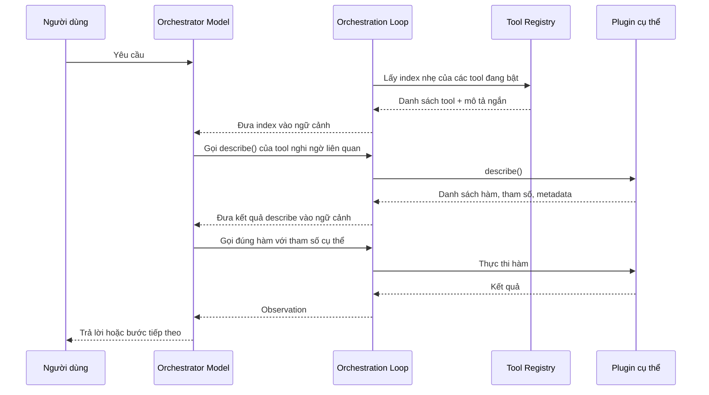
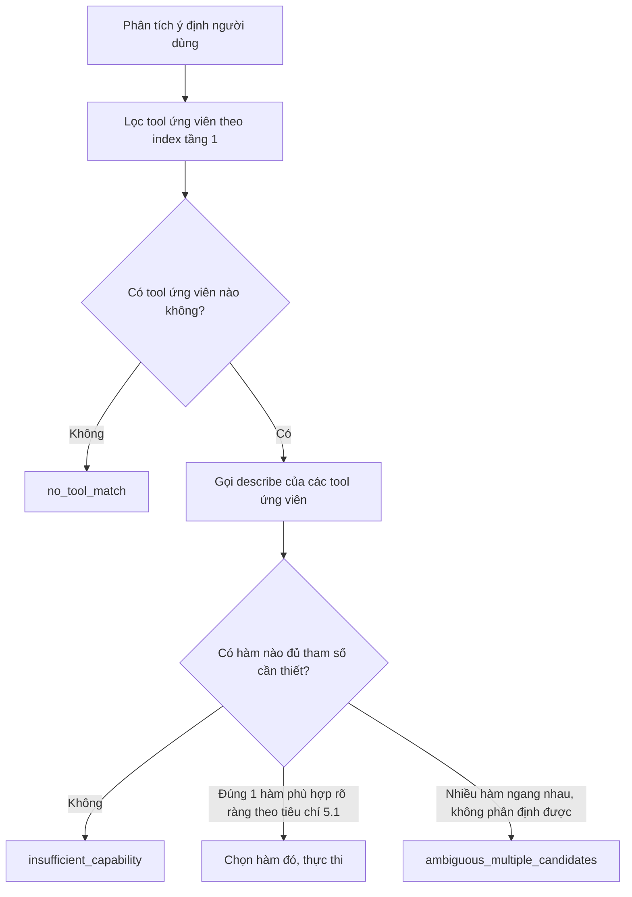

# Tool Plugin Architecture — Đặc tả kỹ thuật

## 1. Mục đích tài liệu và liên hệ với PLAN.md gốc

Tài liệu này đặc tả chi tiết cách tool được tổ chức như một **plugin**: có thể thêm, gỡ, cập nhật độc lập với model, không đụng tới quá trình huấn luyện. Đây là bản cụ thể hoá cho ba mục còn để ngỏ ở `PLAN.md` gốc:

- **ADR-005** (Tool catalog nằm ngoài trọng số model) — tài liệu này là cách hiện thực hoá cụ thể.
- **OQ-5** (Format schema mô tả tool là gì) — tài liệu này đề xuất một câu trả lời cụ thể (Recommendation, chưa phải quyết định cuối cùng).
- **TASK-2** (Thiết kế Tool Catalog) — nội dung dưới đây là bản đặc tả chi tiết cho task này.

## 2. Nguyên tắc cốt lõi: Tool là Plugin, không phải kiến thức huấn luyện cứng

Ba nguyên tắc bắt buộc:

1. **Thêm tool mới = thêm một entry vào registry.** Không sửa code model, không huấn luyện lại.
2. **Model không "biết trước" tool nào tồn tại.** Danh sách tool hiện có được cung cấp tại thời điểm chạy (runtime), không nằm trong tham số model.
3. **Model không tự đi truy vấn registry.** Đây là điểm cần làm rõ so với cách diễn đạt ban đầu: bản thân model chỉ sinh văn bản, nó không có khả năng tự "hỏi" bất cứ hệ thống nào. Chính **Orchestration Loop** (đã mô tả ở `PLAN.md` gốc) là bên thực sự truy vấn registry, lấy danh sách tool, rồi đưa vào ngữ cảnh (context) trước khi gọi model. Việc model "khám phá thêm chi tiết một tool" cũng không phải là model tự làm — đó là một lệnh gọi tool bình thường, đi qua đúng cơ chế parse & dispatch đã bàn ở phần trước, chỉ khác là tool được gọi ở đây là "hàm tự mô tả" của chính plugin đó.

### 2.1. Vòng đời plugin trong kho chung (registry lifecycle)

Ba giai đoạn, ứng với đúng mô tả ban đầu "dev cung cấp tool lên một không gian chung, người dùng download tool đó về":

1. **Publish:** Developer đóng gói tool theo đúng cấu trúc ở mục 4 (registry entry + hàm `describe`), đăng lên kho chung (registry). Kho chung là hạ tầng chia sẻ, tách biệt hoàn toàn khỏi model và khỏi quá trình huấn luyện.
2. **Enable / "Download":** Người dùng chọn một tool từ kho chung để kích hoạt cho phiên làm việc hoặc máy của họ. Đây là hành động ở tầng ứng dụng (cài đặt/kết nối), không liên quan gì tới model hay việc huấn luyện lại.
3. **Runtime awareness:** Ngay khi một tool được enable, Orchestration Loop tự động đưa nó vào index tầng 1 (mục 3) ở lần gọi model kế tiếp. Model không cần biết trước sự tồn tại của tool — nó chỉ nhìn thấy tool đã có mặt trong ngữ cảnh của lượt gọi hiện tại. Gỡ tool diễn ra ngược lại: gỡ khỏi index, model sẽ không còn thấy nó ở các lượt sau.

Chưa xác định trong hội thoại (Decision required): kho chung có cần cơ chế xét duyệt (review) tool trước khi công khai hay không — xem thêm mục 8 (Rủi ro và giới hạn đã biết).

## 3. Kiến trúc khám phá hai tầng (two-tier discovery)

Nếu nhồi toàn bộ tài liệu chi tiết của mọi tool vào mỗi lần gọi model, ngữ cảnh sẽ phình to rất nhanh — mâu thuẫn trực tiếp với mục tiêu "cực nhanh, rất nhẹ" đã đặt ra từ đầu dự án. Giải pháp là tách việc khám phá tool thành hai tầng:

- **Tầng 1 — Index nhẹ (luôn có trong ngữ cảnh):** chỉ gồm tên tool và mô tả ngắn gọn (1 câu) cho mỗi tool đang được bật. Đủ để model lọc ra tool nào *có khả năng* liên quan.
- **Tầng 2 — Mô tả sâu (chỉ gọi khi cần):** khi model nghi ngờ một tool cụ thể liên quan tới yêu cầu, nó gọi hàm tự mô tả của chính tool đó để lấy danh sách đầy đủ các chức năng, tham số, và điều kiện nên dùng. Bước này chỉ tốn thêm ngữ cảnh cho đúng những tool thực sự liên quan, không phải toàn bộ registry.



## 4. Cấu trúc chuẩn của một Tool (Plugin)

### 4.1. Tầng 1 — Registry entry

Mỗi tool khi publish lên "kho chung" (registry) cần khai báo tối thiểu các trường sau:

```json
{
  "tool_id": "os_file_editor",
  "version": "1.0.0",
  "short_description": "Đọc, sửa, tạo file trên hệ điều hành cục bộ",
  "sensitivity": "high",
  "reliability": "high"
}
```

- `short_description`: một câu, dùng để model lọc sơ bộ ở tầng 1 — không mô tả chi tiết từng hàm.
- `sensitivity`: mức độ nhạy cảm tổng quát của tool (`low` / `medium` / `high` / `critical`) — liên hệ trực tiếp tới **TASK-7** (whitelist, xác nhận người dùng) ở `PLAN.md` gốc.
- `reliability`: độ tin cậy khai báo tường minh (`low` / `medium` / `high`) — liên hệ trực tiếp tới **Problem P3** (tránh model tự suy luận sai lệch giữa các tool có chức năng tương tự). Mức độ này do developer tự đánh giá tại thời điểm publish; xem giới hạn của việc tự khai báo ở mục 8.

### 4.2. Tầng 2 — Kết quả của hàm tự mô tả (`describe`)

Đây là phần bắt buộc mọi plugin phải có: một hàm với tên dành riêng (reserved) là `describe`, nhận tham số rỗng, trả về danh sách toàn bộ chức năng của chính plugin đó. Tên hàm này phải thống nhất tuyệt đối giữa mọi plugin — nếu mỗi plugin tự đặt một tên khác nhau cho hàm tự mô tả (`describe`, `list_functions`, `get_info`...), model sẽ không còn cách nào để gọi discovery một cách nhất quán, và toàn bộ lợi ích của kiến trúc hai tầng ở mục 3 sẽ mất tác dụng.

```json
{
  "tool_id": "os_file_editor",
  "functions": [
    {
      "name": "read_file",
      "description": "Đọc toàn bộ nội dung một file văn bản",
      "parameters": { "path": { "type": "string", "required": true } },
      "when_to_use": "Cần xem nội dung file trước khi sửa",
      "sensitivity": "low"
    },
    {
      "name": "write_file",
      "description": "Ghi đè nội dung mới vào một file đã xác định đường dẫn",
      "parameters": {
        "path": { "type": "string", "required": true },
        "content": { "type": "string", "required": true }
      },
      "when_to_use": "Đã có nội dung mới cần lưu vào đúng một file cụ thể",
      "sensitivity": "high"
    },
    {
      "name": "run_shell_command",
      "description": "Chạy một lệnh shell bất kỳ trên hệ điều hành",
      "parameters": { "command": { "type": "string", "required": true } },
      "when_to_use": "Chỉ dùng khi không có hàm chuyên biệt nào phù hợp",
      "sensitivity": "critical"
    }
  ]
}
```

Mỗi hàm khai báo `sensitivity` và `when_to_use` **riêng của chính nó**, không chỉ ở cấp tool — vì trong cùng một tool, các hàm có thể khác nhau rất nhiều về mức độ rủi ro (đọc file rủi ro thấp, chạy lệnh shell tuỳ ý rủi ro cao nhất).

### 4.3. Định dạng lệnh gọi từ model

Cơ chế parse & dispatch đã bàn ở phần trước của hội thoại cần một định dạng thống nhất để model chỉ định: gọi tool nào, hàm nào trong tool đó, với tham số gì. Vì một plugin có thể có nhiều hàm (như mục 4.2), lệnh gọi bắt buộc phải có đủ ba trường `tool_id`, `function`, `params` — không thể chỉ có tên tool như cách nói đơn giản hoá ở phần trước, vì như vậy code sẽ không biết đang gọi hàm nào trong số nhiều hàm của cùng một tool.

Gọi hàm discovery (tầng 2, mục 4.2):
```json
{ "tool_id": "os_file_editor", "function": "describe", "params": {} }
```

Gọi một hàm cụ thể, sau khi đã biết chữ ký hàm qua kết quả `describe`:
```json
{ "tool_id": "os_file_editor", "function": "write_file", "params": { "path": "config.yaml", "content": "port: 8080" } }
```

Code ở tầng Orchestration Loop parse đúng ba trường này, tra cặp `tool_id` + `function` trong dispatch table, rồi mới thực thi hàm thật với `params` — đúng luồng parse & dispatch đã mô tả ở lượt trao đổi trước.

## 5. Luồng ra quyết định của model

```text
1. Phân tích ý định người dùng → xác định "năng lực" (capability) cần có.
2. So khớp năng lực cần có với index tầng 1 → lọc ra tool ứng viên.
3. Với mỗi tool ứng viên, gọi describe (tầng 2) để lấy danh sách hàm cụ thể.
4. So sánh các hàm ứng viên theo tiêu chí ở mục 5.1.
5. Chọn phương án tốt nhất, hoặc chuyển sang một trong ba trạng thái ở mục 5.2 nếu không đủ điều kiện chọn.
```



### 5.1. Tiêu chí chọn "cách tốt nhất" khi có nhiều lựa chọn khả thi

Đây là câu trả lời cho câu hỏi gốc "model phải biết cách nào tốt nhất để thao tác OS". Quan trọng: model **không cần có sẵn kiến thức bách khoa** về mọi cách thao tác hệ điều hành trong tham số của nó — việc đó vừa không khả thi với một model nhỏ, vừa nhanh lỗi thời. Thay vào đó, model chỉ cần áp dụng đúng các tiêu chí suy luận sau, dựa trên metadata mà chính các tool đã khai báo:

- **Ưu tiên hàm phạm vi hẹp, đúng mục đích hơn hàm tổng quát.** Ví dụ ở mục 4.2: nếu mục tiêu là "ghi nội dung mới vào một file cụ thể", `write_file` đúng mục đích hơn `run_shell_command` dù cả hai đều làm được việc đó — vì phạm vi hẹp hơn có nghĩa là ít khả năng model điền sai tham số, và hậu quả nếu sai cũng giới hạn hơn.
- **Ưu tiên `sensitivity` thấp hơn khi các lựa chọn đáp ứng nhu cầu ngang nhau.** `write_file` (`high`) nên được chọn trước `run_shell_command` (`critical`) nếu cả hai đều làm được việc cần làm.
- **Ưu tiên `reliability` cao hơn khi nhiều tool cùng cung cấp một chức năng tương tự.**
- Đây là các **heuristic suy luận chung**, cần được dạy cho model thông qua dữ liệu huấn luyện đa dạng (TASK-3 ở `PLAN.md` gốc — nên bổ sung các ví dụ có nhiều tool ứng viên cạnh tranh nhau, không chỉ ví dụ có đúng một tool đúng), chứ không phải kiến thức OS cứng nhồi vào tham số.

### 5.2. Ba trạng thái khi tool không đủ đáp ứng

`PLAN.md` gốc (Problem P4) mới chỉ phân biệt hai loại lỗi: lỗi tầng quyết định (`no_tool_match`) và lỗi tầng thực thi (runtime). Với kiến trúc plugin có nhiều tool cạnh tranh, cần bổ sung một trạng thái thứ ba:

| Trạng thái | Khi nào xảy ra | Hành vi mong muốn |
|---|---|---|
| `no_tool_match` | Không tool nào liên quan tới yêu cầu | Thông báo không tìm thấy năng lực phù hợp |
| `insufficient_capability` | Có tool liên quan nhưng thiếu tham số/chức năng cần thiết | Nói rõ đang thiếu gì; có thể gợi ý người dùng cài thêm tool phù hợp từ kho chung |
| `ambiguous_multiple_candidates` | Nhiều hàm/tool cùng khả thi, không có tiêu chí nào ở mục 5.1 phân định rõ | Hỏi lại người dùng thay vì tự đoán — đặc biệt bắt buộc nếu có ứng viên `sensitivity` cao |

*(Recommendation: nên bổ sung trạng thái `ambiguous_multiple_candidates` này vào Problem/Decision Register của `PLAN.md` gốc để giữ tài liệu nhất quán.)*

## 6. Hành vi giao tiếp với người dùng

Đây là điểm phân biệt model này với một "AI cứng ngắc chỉ đưa ra kết quả không cần biết đúng sai" như người dùng mô tả — và nó bổ sung, không thay thế, cho Verification Layer (ADR-004) đã bàn trước đó. Hai cơ chế phục vụ hai thời điểm khác nhau:

- **Verification Layer (ADR-004):** đánh giá độ tin cậy của câu trả lời **sau khi** đã có kết quả, trước khi trả lời cuối.
- **Giao tiếp làm rõ (mục này):** xảy ra **trước khi** hành động, ngay tại bước chọn tool — khi việc chọn tool tự nó đã mơ hồ (trạng thái `ambiguous_multiple_candidates`) hoặc thiếu điều kiện (`insufficient_capability`).

Nguyên tắc: khi rủi ro của việc đoán sai cao hơn chi phí của việc hỏi lại một câu, model nên hỏi lại thay vì tự quyết định.

## 7. Ví dụ minh hoạ: "Sửa một file trên Linux"

**Tình huống A — có tool chuyên biệt (`os_file_editor` đã bật):**

```text
1. Người dùng: "sửa file config.yaml, đổi port thành 8080"
2. Index tầng 1: os_file_editor có mặt, mô tả liên quan tới file → ứng viên.
3. Model sinh: {"tool_id": "os_file_editor", "function": "describe", "params": {}}
   → nhận về read_file, write_file, run_shell_command.
4. Áp dụng tiêu chí mục 5.1: cần đọc trước khi biết nội dung hiện tại → chọn read_file (sensitivity thấp).
5. Sau khi có nội dung, cần ghi nội dung mới vào đúng file đó → model sinh:
   {"tool_id": "os_file_editor", "function": "write_file", "params": {"path": "config.yaml", "content": "port: 8080"}}
   Không chọn run_shell_command, vì write_file phạm vi hẹp hơn và sensitivity thấp hơn trong khi vẫn đáp ứng đủ nhu cầu.
6. write_file thuộc sensitivity "high" → theo TASK-7, cần bước xác nhận người dùng trước khi thực thi thật.
```

**Tình huống B — không có tool chuyên biệt, chỉ có `run_shell_command`:**

```text
1. Cùng yêu cầu, nhưng registry chỉ có run_shell_command (sensitivity "critical").
2. Không có hàm nào phạm vi hẹp hơn đáp ứng được → đây không còn là trường hợp "nhiều lựa chọn ngang nhau"
   (mục 5.2 không áp dụng vì chỉ có một ứng viên), nhưng sensitivity ở mức "critical".
3. Theo TASK-7 (Security Considerations), hành động sensitivity "critical" luôn bắt buộc xác nhận người dùng
   trước khi thực thi — không có ngoại lệ, kể cả khi đây là lựa chọn duy nhất.
4. Model nên nói rõ với người dùng: "Chỉ có công cụ chạy lệnh shell trực tiếp, chưa có công cụ sửa file
   chuyên biệt an toàn hơn — bạn có muốn tiếp tục không?" thay vì âm thầm thực thi.
```

## 8. Rủi ro và giới hạn đã biết

| Rủi ro / giới hạn | Mô tả | Khuyến nghị |
|---|---|---|
| Metadata tự khai báo không đáng tin tuyệt đối | `sensitivity` và `reliability` (mục 4.1, 4.2) do chính plugin tự khai báo — một plugin viết sai, hoặc cố tình khai `sensitivity: low` cho một hành động thực chất nguy hiểm, sẽ khiến cơ chế xác nhận ở TASK-7 bị bỏ qua nhầm | Decision required: kho chung cần cơ chế xét duyệt (review) trước khi publish, đặc biệt với tool khai sensitivity thấp nhưng có khả năng thực thi lệnh hệ thống — xem mục 2.1 |
| `describe` có thể lỗi hoặc timeout | Đây là một lệnh gọi tool bình thường (mục 4.3), nên có thể gặp mọi loại lỗi runtime đã mô tả ở Problem P4 của `PLAN.md` gốc | Orchestration Loop xử lý lỗi này giống mọi lỗi runtime khác — không phải việc model tự đoán trước |
| Version plugin thay đổi giữa các lần gọi | Nếu chữ ký hàm (tên hàm, tham số) thay đổi giữa hai lần `describe`, model có thể dùng nhầm thông tin cũ đã cache trong ngữ cảnh | Recommendation: Orchestration Loop nên làm mới (invalidate) mọi cache liên quan tới một `tool_id` khi phát hiện trường `version` trong registry entry thay đổi |
| Độ trễ khi phải gọi `describe` lặp lại | Nếu không cache, một tác vụ nhiều bước có thể phải gọi lại `describe` cho cùng một tool nhiều lần, ảnh hưởng mục tiêu tốc độ đã đặt ra từ đầu dự án | Recommendation: cache kết quả `describe` trong phạm vi một phiên hội thoại, chỉ làm mới khi version thay đổi hoặc phiên kết thúc |

## 9. Điều kiện chấp nhận (Acceptance Criteria) cho đặc tả này

```text
- Thêm một plugin mới vào registry và model sử dụng đúng nó mà không cần sửa code model hay huấn luyện lại.
- Index tầng 1 chỉ chứa tool_id, short_description, sensitivity, reliability — không chứa chi tiết từng hàm.
- Mọi lệnh gọi tool do model sinh ra đều có đủ ba trường tool_id, function, params (mục 4.3).
- Mọi hàm có sensitivity "critical" đều bắt buộc đi qua bước xác nhận người dùng, không có ngoại lệ,
  kể cả khi đó là lựa chọn duy nhất khả thi (xem Tình huống B ở mục 7).
- Trạng thái ambiguous_multiple_candidates luôn dẫn tới việc hỏi lại người dùng, không bao giờ tự chọn
  ngẫu nhiên hoặc chọn theo thứ tự xuất hiện trong danh sách.
- Mọi plugin đều triển khai đúng một hàm tên describe, không có tên thay thế khác.
```

## 10. Liên hệ ngược lại với PLAN.md gốc

Tài liệu này đề xuất câu trả lời cụ thể cho **OQ-5** (định dạng schema tool và định dạng lệnh gọi — mục 4), bổ sung một trạng thái lỗi mới (`ambiguous_multiple_candidates`) chưa có trong Problem Register gốc, và nêu thêm một Open Question mới về cơ chế xét duyệt cho kho chung (mục 8). Đây vẫn là **Recommendation**, chưa phải quyết định chính thức — cần được xác nhận trước khi đưa vào implement ở TASK-2.